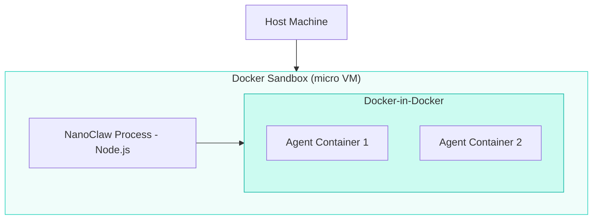

Docker Sandboxes wrap your entire NanoClaw instance — including its agent containers — inside a lightweight micro VM. This gives you **two layers of isolation**: the sandbox VM boundary on the outside, and per-agent Docker containers on the inside.

## Architecture



## Requirements

- **Docker Desktop v4.40+** with sandbox capabilities enabled
- **Anthropic API key**
- **Platform credentials** for your messaging channels (e.g., Telegram bot token, WhatsApp phone number, Discord bot token, Slack app token)

## Setup

<Steps>
  <Step title="Patch the Dockerfile for proxy support">
    Docker Sandboxes use a MITM proxy for network isolation. The Dockerfile must accept proxy build arguments so the container can install packages through the proxy:

    ```dockerfile
    ARG http_proxy
    ARG https_proxy
    ARG NODE_EXTRA_CA_CERTS
    ```
  </Step>

  <Step title="Update the build script">
    Forward proxy environment variables during `docker build` so that package managers (apt, npm) can reach the internet through the sandbox proxy:

    ```bash
    docker build \
      --build-arg http_proxy="$http_proxy" \
      --build-arg https_proxy="$https_proxy" \
      ...
    ```
  </Step>

  <Step title="Patch the container runner">
    Three changes are required in `src/container-runner.ts`:

    1. **Replace `/dev/null` mounts** with empty files — `/dev/null` bind-mounts don't work inside sandboxes
    2. **Forward proxy environment variables** to spawned agent containers (`http_proxy`, `https_proxy`, `NODE_EXTRA_CA_CERTS`)
    3. **Mount the sandbox CA certificate** so agent containers trust the MITM proxy
  </Step>

  <Step title="Configure upstream API calls">
    If your code makes HTTPS requests to the Anthropic API or other services, configure `HttpsProxyAgent` to route through the sandbox proxy:

    ```typescript
    import { HttpsProxyAgent } from 'https-proxy-agent';

    const agent = new HttpsProxyAgent(process.env.https_proxy);
    ```
  </Step>

  <Step title="Channel-specific patches">
    Each messaging channel may need additional proxy configuration:

    - **Telegram**: Ensure the grammy HTTP client uses the proxy agent
    - **WhatsApp**: Configure proxy bypass for `web.whatsapp.com` domains, and authenticate via QR code or pairing code
  </Step>
</Steps>

## Troubleshooting

<Accordion title="SSL certificate errors">
  The sandbox MITM proxy terminates TLS connections. If you see `UNABLE_TO_VERIFY_LEAF_SIGNATURE` or similar errors:

  ```bash
  export NODE_TLS_REJECT_UNAUTHORIZED=0  # Development only!
  ```

  For production, mount the sandbox CA certificate and set `NODE_EXTRA_CA_CERTS`.
</Accordion>

<Accordion title="Path mounting failures">
  Ensure NanoClaw lives inside the sandbox workspace directory. Paths outside the workspace are not accessible from within the sandbox.
</Accordion>

<Accordion title="Agent containers can't reach the network">
  Verify that proxy environment variables are forwarded to agent containers. Check the container runner patch in Step 3 above.

  ```bash
  docker exec <container> env | grep -i proxy
  ```
</Accordion>

<Accordion title="WhatsApp authentication issues">
  WhatsApp's web client needs direct access to `web.whatsapp.com`. Configure a proxy bypass for this domain in your WhatsApp channel adapter.
</Accordion>

## When to use Docker Sandboxes

| Scenario | Recommended? |
|----------|-------------|
| Personal use on trusted hardware | Standard Docker is sufficient |
| Shared server or multi-tenant environment | Yes — adds VM-level isolation |
| Running untrusted community skills | Yes — limits blast radius |
| CI/CD or automated testing | Yes — reproducible isolated environment |

<Note>
  Docker Sandboxes add latency to container operations due to the nested virtualization layer. For most workloads this is negligible, but latency-sensitive setups may prefer standard Docker.
</Note>

## Related pages

- [Container runtime](/advanced/container-runtime) — Standard container execution details
- [Security model](/advanced/security-model) — NanoClaw's security boundaries
- [Troubleshooting](/advanced/troubleshooting) — General debugging guide
