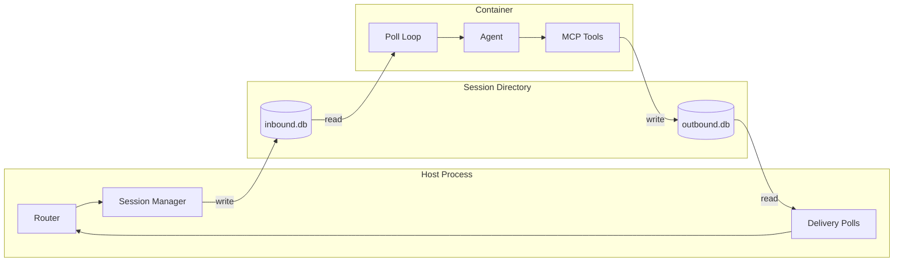

In v2, NanoClaw replaced the filesystem-based IPC system with a **two-database model**. All communication between the host process and containerized agents flows through two SQLite databases per session — `inbound.db` and `outbound.db`.

## Architecture overview

The v2 IPC model is built on three principles:

1. **Single writer per file** — `inbound.db` is only written by the host; `outbound.db` is only written by the container
2. **No filesystem polling** — the container polls `inbound.db` directly; the host polls `outbound.db` directly
3. **No stdin/stdout** — no piped input, no output markers, no IPC files



## How it works

### Inbound flow (host to container)

<Steps>
  <Step title="Message arrives">
    A channel adapter receives a message and routes it through the inbound router.
  </Step>

  <Step title="Session resolution">
    The session manager resolves or creates a session based on the wiring's `session_mode` (shared, per-thread, or agent-shared).
  </Step>

  <Step title="Write to inbound.db">
    The message is written to the `messages_in` table in `inbound.db`. File attachments are extracted to `inbox/{messageId}/`.
  </Step>

  <Step title="Container wakes">
    The container runner wakes the container (or spawns a new one). The agent-runner's poll loop discovers the new message.
  </Step>

  <Step title="Agent processes">
    The agent processes the message through the configured provider (Claude by default).
  </Step>
</Steps>

### Outbound flow (container to host)

<Steps>
  <Step title="Agent writes response">
    The agent writes to `outbound.db`'s `messages_out` table. File attachments go to `outbox/{messageId}/`.
  </Step>

  <Step title="Delivery poll">
    The host's active delivery poll (1s interval) reads due messages from `outbound.db`.
  </Step>

  <Step title="Deduplication">
    Already-delivered messages are filtered using the `delivered` table in `inbound.db`.
  </Step>

  <Step title="Routing">
    Messages are routed by kind:
    - `system` — dispatched to registered delivery action handlers (scheduling, approvals, etc.)
    - `channel_type='agent'` — routed to the agent-to-agent module
    - Normal messages — permission check, then channel adapter delivery
  </Step>

  <Step title="Delivery">
    The message is delivered via the appropriate channel adapter. File attachments are read from `outbox/{messageId}/` and cleaned up after delivery.
  </Step>
</Steps>

## Database tables

### inbound.db (host writes, container reads)

| Table | Purpose |
|-------|---------|
| `messages_in` | Inbound messages with status, `process_after`, recurrence, `series_id`, trigger flag |
| `delivered` | Tracks delivery outcomes for outbound message IDs |
| `destinations` | Live destination map for the agent (channels and other agents). Overwritten on every wake |
| `session_routing` | Single-row default reply routing (channel_type, platform_id, thread_id) |

### outbound.db (container writes, host reads)

| Table | Purpose |
|-------|---------|
| `messages_out` | Outbound messages with `deliver_after` and recurrence |
| `processing_ack` | Tracks which inbound messages the container has processed |
| `session_state` | Persistent key/value store (e.g., SDK session ID for resume across restarts) |
| `container_state` | Tool-in-flight state (tool name, declared timeout, start time) for stuck-detection |

## MCP tools (container-side)

Instead of writing IPC files, the container uses MCP tools that write to `outbound.db`:

| Tool | Purpose |
|------|---------|
| `send_message` | Write an outbound message for delivery |
| `schedule_task` | Request task creation (host creates in `inbound.db`) |
| `cancel_task` | Cancel a recurring task series |
| `pause_task` | Pause a pending task |
| `resume_task` | Resume a paused task |
| `update_task` | Update task content or schedule |

These tools write `kind='system'` messages to `outbound.db` with action fields. The host's delivery pipeline routes them to the appropriate module handler.

## Delivery action registry

Modules register handlers via `registerDeliveryAction(action, handler)`:

```typescript
// Example: scheduling module registers handlers
registerDeliveryAction('schedule_task', handleScheduleTask);
registerDeliveryAction('cancel_task', handleCancelTask);
registerDeliveryAction('pause_task', handlePauseTask);
```

This extensible pattern replaces a monolithic switch statement. When `dispatchResponse` encounters a system message, it iterates registered handlers until one claims the response.

## Cross-mount SQLite invariants

Three invariants are critical for the two-DB model to work correctly across Docker bind mounts:

1. **`journal_mode=DELETE`** — WAL mode's memory-mapped `-shm` file doesn't refresh host-to-guest; the container would miss messages
2. **Host opens-writes-closes per operation** — closing the database connection invalidates the container's page cache, forcing it to see new data
3. **One writer per file** — DELETE-mode journal unlink isn't atomic across the mount boundary

<Warning>
Violating any of these invariants causes subtle data visibility bugs. The host must close its database connection after each write operation to ensure the container sees the update.
</Warning>

## Delivery polls

The host uses two poll loops to read from `outbound.db`:

| Poll | Interval | Scope |
|------|----------|-------|
| Active | 1 second | Sessions with running containers |
| Sweep | 60 seconds | All active sessions |

The sweep poll catches messages from containers that exited between active polls. An in-flight delivery set prevents double-delivery when both polls hit the same session.

## Host sweep

The host sweep (60s) performs four operations:

1. **processing_ack sync** — reads `processing_ack` from `outbound.db` and updates `messages_in` status in `inbound.db`
2. **Stale detection** — identifies containers with old `.heartbeat` mtime or stuck `processing_ack`
3. **Due-message wake** — finds tasks where `process_after <= now` and wakes containers
4. **Recurrence advancement** — creates next-occurrence rows for completed recurring tasks

## Security model

### Identity verification

Container identity is determined by mount paths — each container can only write to its own session's `outbound.db`. This is enforced at mount time, not by file contents.

### Delivery authorization

The delivery system enforces per-agent permissions:

- Messages to the origin chat are always permitted
- Cross-channel delivery requires an explicit `agent_destinations` row
- Unauthorized delivery attempts are logged and rejected

### Error handling

Failed deliveries are retried up to 3 times, then permanently marked as failed. The attempt counter resets on process restart.

## Debugging

<Accordion title="Inspect session databases">
  ```bash
  sqlite3 data/v2-sessions/{agent_group_id}/{session_id}/inbound.db \
    "SELECT * FROM messages_in ORDER BY seq DESC LIMIT 10;"

  sqlite3 data/v2-sessions/{agent_group_id}/{session_id}/outbound.db \
    "SELECT * FROM messages_out ORDER BY seq DESC LIMIT 10;"
  ```
</Accordion>

<Accordion title="Check processing acknowledgments">
  ```bash
  sqlite3 data/v2-sessions/{agent_group_id}/{session_id}/outbound.db \
    "SELECT * FROM processing_ack ORDER BY seq DESC LIMIT 10;"
  ```
</Accordion>

<Accordion title="View container state">
  ```bash
  sqlite3 data/v2-sessions/{agent_group_id}/{session_id}/outbound.db \
    "SELECT * FROM container_state;"
  ```
</Accordion>

<Accordion title="Check delivery status">
  ```bash
  sqlite3 data/v2-sessions/{agent_group_id}/{session_id}/inbound.db \
    "SELECT * FROM delivered ORDER BY rowid DESC LIMIT 10;"
  ```
</Accordion>

## Related pages

- [Security model](/advanced/security-model) — authorization and trust boundaries
- [Container runtime](/advanced/container-runtime) — how agents execute in containers
- [Troubleshooting](/advanced/troubleshooting) — common issues
