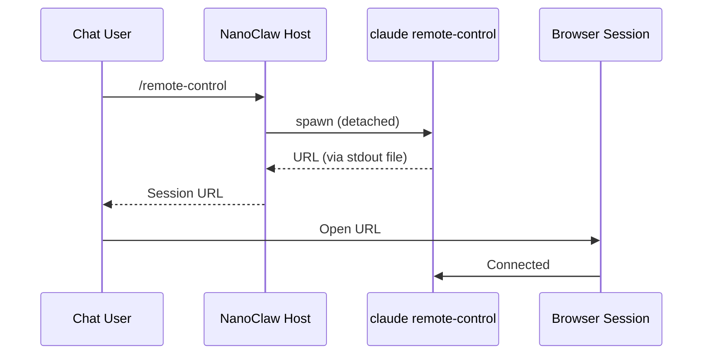

<Note>
  Remote Control was added in **v1.2.14** ([PR #1072](https://github.com/qwibitai/nanoclaw/pull/1072)).
</Note>

Remote Control lets you open a full Claude Code session in your browser that runs inside your NanoClaw project directory. The session is managed by the host process — start it from the main group's chat on any connected channel, share the URL, and stop it when you're done.

<Warning>
  Remote Control is restricted to the **main group only**. Commands sent from non-main groups are silently rejected. This is because the session has full host-level access to the NanoClaw project directory.
</Warning>

## How it works

The `/remote-control` command spawns a detached `claude remote-control` child process on the host. NanoClaw polls the process output for a session URL (a `https://claude.ai/code?bridge=...` link), then returns it to the chat that requested it.



### Session lifecycle

<Steps>
  <Step title="Start">
    A user sends `/remote-control` in the **main group's** chat. NanoClaw spawns `claude remote-control --name "NanoClaw Remote"` as a detached child process with its working directory set to the project root.
  </Step>

  <Step title="URL detection">
    The host polls a stdout file every 200 ms for a URL matching `https://claude.ai/code...`. A 30-second timeout applies — if no URL appears, the session is considered failed.
  </Step>

  <Step title="State persistence">
    Once the URL is captured, session metadata (PID, URL, who started it, timestamp) is written to a JSON state file. This allows the session to survive host restarts.
  </Step>

  <Step title="Use">
    Anyone with the URL can open the Claude Code session in their browser. The session has full access to the NanoClaw project directory.
  </Step>

  <Step title="Stop">
    Send `/remote-control-end` to terminate the session. The host sends `SIGTERM` to the process and removes the state file.
  </Step>
</Steps>

## Usage

### Starting a session

From the main group's chat on any connected channel (Telegram, WhatsApp, Discord, etc.):

```
/remote-control
```

NanoClaw responds with the session URL:

```
https://claude.ai/code?bridge=env_abc123
```

### Checking status

If a session is already running and the process is still alive, calling `/remote-control` again returns the existing URL without spawning a new process. If the process has died, NanoClaw automatically clears the stale session and starts a new one.

### Stopping a session

```
/remote-control-end
```

This sends `SIGTERM` to the running process and cleans up state.

## Session recovery

If the NanoClaw host process restarts (e.g., after an update or crash), it calls `restoreRemoteControl()` at startup. This:

1. Reads the persisted state file
2. Checks whether the process is still alive (via `kill(pid, 0)`)
3. If alive — restores the session so it can be stopped or its URL re-shared
4. If dead — cleans up the stale state file

<Note>
  The child process is spawned with `detached: true` and immediately unreferenced, so it continues running even if the NanoClaw host exits.
</Note>

## Implementation details

### Process isolation

The `claude remote-control` process is fully decoupled from the parent:

- **Detached**: `detached: true` puts the child in its own process group
- **Unreferenced**: `proc.unref()` allows the parent to exit without waiting
- **File-based I/O**: stdout and stderr are redirected to files (not pipes), preventing broken-pipe issues during parent restarts
- **File descriptors closed in parent**: After spawn, the parent closes its copies of the stdout/stderr file descriptors since the child inherits its own

### State file

Session state is persisted to `{DATA_DIR}/remote-control.json`:

```json
{
  "pid": 12345,
  "url": "https://claude.ai/code?bridge=env_abc123",
  "startedBy": "user1",
  "startedInChat": "tg:123",
  "startedAt": "2026-03-14T10:30:00.000Z"
}
```

### Error handling

| Scenario | Behavior |
|----------|----------|
| `claude` binary not found | Returns `Failed to start: ENOENT` |
| Process exits before URL appears | Returns `Process exited before producing URL` |
| URL doesn't appear within 30 s | Returns `Timed out waiting for Remote Control URL` |
| Stop called with no active session | Returns `No active Remote Control session` |
| Corrupted state file on restore | State file is deleted, no session restored |

## Security considerations

<Warning>
  The Remote Control URL grants full Claude Code access to your NanoClaw project directory. Only share it with trusted users.
</Warning>

- The session runs with the same permissions as the NanoClaw host process
- Anyone with the URL can execute commands in the project directory
- Sessions persist until explicitly stopped or the process exits
- There is no built-in authentication beyond the URL itself

## Related pages

- [Container runtime](/advanced/container-runtime) — How NanoClaw runs agent containers
- [Security model](/advanced/security-model) — Security boundaries and isolation
- [Troubleshooting](/advanced/troubleshooting) — Common issues and debugging
