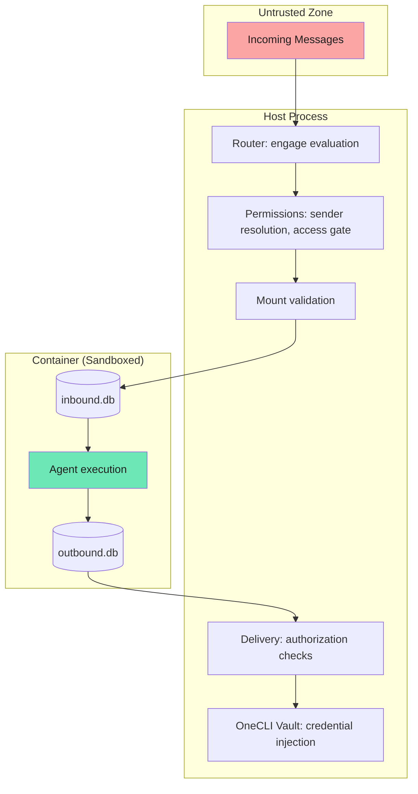

NanoClaw's security model is built on OS-level isolation rather than application-level permission checks. In v2, a new permissions module adds user roles, sender scope enforcement, channel approval, and delivery authorization.

## Trust model

NanoClaw operates with different trust levels:

| Entity | Trust Level | Rationale |
|--------|-------------|-----------|
| Owner | Fully trusted | System administrator |
| Admins | Trusted | Can approve senders (global or scoped) |
| Known users | Permitted | Members of agent groups |
| Unknown senders | Untrusted | Policy-controlled per messaging group |
| Container agents | Sandboxed | Isolated execution environment |

## Security boundaries

### Container isolation (primary boundary)

Agents execute in containers, providing:

- **Process isolation** — container processes cannot affect the host
- **Filesystem isolation** — only explicitly mounted directories are visible
- **Non-root execution** — runs as unprivileged `node` user (uid 1000)
- **Signal forwarding** — `tini` as PID 1 ensures clean shutdown and database finalization

### Mount security

**External allowlist** at `~/.config/nanoclaw/mount-allowlist.json`:

- Outside the project root, never mounted into containers
- Cannot be modified by agents

**Default blocked patterns:**

```json
[
  ".ssh", ".gnupg", ".gpg", ".aws", ".azure", ".gcloud", ".kube", ".docker",
  "credentials", ".env", ".netrc", ".npmrc", ".pypirc", "id_rsa", "id_ed25519",
  "private_key", ".secret"
]
```

**Protections:**

- Symlink resolution before validation (prevents traversal)
- Container path validation (rejects `..`, absolute paths, colons)
- RW gating — requires both mount request AND allowed root to permit read-write
- Missing allowlist file blocks all additional mounts (not cached — create without restart)
- Parse errors are permanently cached for the process lifetime

### Permissions module

The permissions module (`src/modules/permissions/`) registers hooks into the core router:

**Sender resolver** — extracts namespaced user ID from message content and upserts the `users` row on first sight:

```typescript
// User ID format: channelType:handle
// Examples: phone:+15551234567, tg:123456, discord:789012
```

**Access gate** — enforces `unknown_sender_policy` per messaging group:

| Policy | Behavior |
|--------|----------|
| `public` | Skip access check entirely |
| `strict` | Unknown senders silently dropped |
| `request_approval` | Approval card sent to admin |

**Sender scope gate** — per-wiring enforcement:

- `sender_scope='known'` requires the user to be an owner, admin, or group member even on public channels

**Channel request gate** — for unwired channels:

- Escalates to owner for approval
- Approve: creates wiring with defaults, admits sender, replays message
- Deny: sets `denied_at`, future mentions silently dropped

### Attachment filename safety

Filenames on inbound attachments are attacker-controlled — E2EE platforms cannot sanitize them server-side, and a compromised peer agent can produce them on the agent-to-agent path. `isSafeAttachmentName()` (in `attachment-safety.ts`) rejects empty strings, `.`, `..`, anything containing `/`, `\`, or NUL, and any value where `path.basename(name)` differs from the input. Rejected names are replaced with `attachment-<timestamp>` so data still lands inside the inbox directory.

The router also drops, rather than accumulates, ignored messages when the access or scope gate explicitly refused the sender, so untrusted attachments are not staged to disk on a refusal.

### Session isolation

Each session has isolated databases:

- `data/v2-sessions/{agent_group_id}/{session_id}/inbound.db`
- `data/v2-sessions/{agent_group_id}/{session_id}/outbound.db`

Sessions cannot see other sessions' data. Cross-session information disclosure is prevented by mount isolation.

### Delivery authorization

The delivery system enforces per-agent permissions:

- Messages to the origin chat are always permitted
- Cross-channel delivery requires an explicit `agent_destinations` row
- System messages (scheduling, approvals) are routed through registered delivery action handlers
- File attachments are read from `outbox/{messageId}/`
- 3 retry attempts per message, then permanently failed

### Credential handling

NanoClaw delegates all credential management to the OneCLI Agent Vault:

- The `@onecli-sh/sdk` package's `applyContainerConfig()` configures each container's network
- The vault intercepts HTTPS traffic and injects registered secrets
- Each agent group receives a unique `agentIdentifier` for per-group credential scoping
- `ONECLI_URL` (default `http://localhost:10254`) configures the vault address

**Not mounted:**

- Real API keys or OAuth tokens — injected by vault, never in containers
- Mount allowlist — external, never mounted
- `.env` file — configuration only (no credentials)

## Privilege comparison

| Capability | Owner | Admin (scoped) | Member | Unknown (public) | Unknown (strict) |
|------------|-------|---------------|--------|-------------------|-------------------|
| All operations | ✓ | — | — | — | — |
| Approve senders | ✓ | Within scope | — | — | — |
| Approve channels | ✓ | — | — | — | — |
| Interact with agents | ✓ | ✓ | ✓ | ✓ | Dropped |
| Cross-agent messaging | ✓ | ✓ | ✓ | — | — |

## Security architecture diagram



## Best practices

<Accordion title="Use request_approval for public groups">
  Set `unknown_sender_policy='request_approval'` to require admin approval for new senders. This prevents unauthorized access while allowing legitimate users to be admitted.
</Accordion>

<Accordion title="Scope admin roles">
  Create per-agent-group admins instead of global admins. Scoped admins can only approve senders for their assigned group.
</Accordion>

<Accordion title="Review mount allowlist regularly">
  Check `~/.config/nanoclaw/mount-allowlist.json` to ensure only necessary directories are mounted. Remove entries you no longer need.
</Accordion>

<Accordion title="Use sender_scope=known for sensitive wirings">
  Even on public channels, `sender_scope='known'` restricts interaction to group members, admins, and owner.
</Accordion>

<Accordion title="Monitor delivery authorization">
  Check logs for unauthorized delivery attempts. The delivery system logs rejected cross-channel messages.
</Accordion>

## Related pages

- [Container runtime](/advanced/container-runtime) — container execution details
- [Troubleshooting](/advanced/troubleshooting) — common security-related issues
