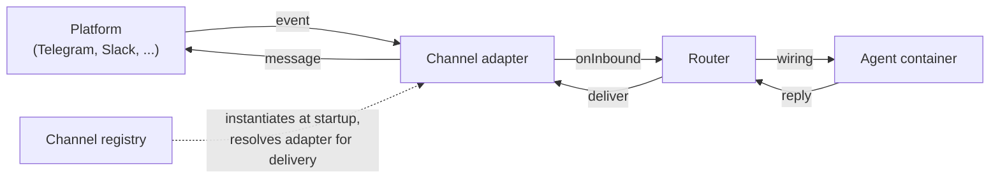

{/* verified-against: src/channels/{adapter,channel-registry,channel-defaults,index,chat-sdk-bridge,cli}.ts, src/webhook-server.ts, setup/auto.ts, setup/channels/run-channel-skill.ts, .claude/skills/{manage-channels,add-telegram}/SKILL.md @ e926e30e (v2.1.53); channels branch src/channels/ @ 7f24dd31 */}

NanoClaw trunk ships channel **infrastructure** — the adapter interface, the registry, the Chat SDK bridge, the webhook server — plus one built-in channel: `cli`, an always-on local-terminal channel that needs no credentials. Every platform adapter (Telegram, Discord, Slack, WhatsApp, …) lives on the `channels` branch of the repo and is installed on demand with an `/add-<channel>` skill. Your fork only contains the channels you actually use.

## How a message flows

Adapters self-register with the channel registry on import. At startup the host instantiates every registered adapter whose credentials are present (a factory that finds no credentials returns `null` and the channel is skipped with a warning). From there, every channel takes the same path:



The adapter normalizes platform events into inbound messages; the router matches them to a wiring (which agent group handles which chat) and writes them into the right session; the agent's reply drains through the delivery module, which looks up the owning adapter in the registry — by the messaging group's `instance` (which defaults to the channel type) — and calls `deliver()`, so a reply always leaves through the same adapter the message arrived on.

Adapters come in two flavors:

- **Chat SDK adapters** — wrap a [Chat SDK](https://github.com/vercel/chat) platform adapter (the `chat` npm package and its `@chat-adapter/*` family) via the bridge in `src/channels/chat-sdk-bridge.ts`. The bridge handles mention detection, attachments, reply context, interactive question cards, and splitting long messages to fit platform limits. Discord, Slack, Telegram, Teams, and most others use this pattern.
- **Native adapters** — implement the `ChannelAdapter` interface directly. Used where no Chat SDK adapter fits: WhatsApp (Baileys), Signal (signal-cli), WeChat, Delta Chat, Emacs, and the built-in CLI channel.

## What an `/add-<channel>` skill does

Each install skill follows the same pattern (see `/add-telegram` for the canonical example):

1. **Fetch the `channels` branch** — `git fetch origin channels`
2. **Copy the adapter** — `git show origin/channels:src/channels/<name>.ts > src/channels/<name>.ts`, along with its tests, helpers, and any setup steps
3. **Wire the barrel** — append `import './<name>.js';` to `src/channels/index.ts` so the adapter self-registers at startup
4. **Install the platform package, pinned** — e.g. `pnpm install @chat-adapter/telegram@<exact-version>` (each skill pins its own version)
5. **Build and validate** — `pnpm run build` plus the channel's registration test, which asserts the adapter actually lands in the registry
6. **Collect credentials** — bot tokens, QR pairing, linked devices, whatever the platform needs, into `.env`

The skills are idempotent — every step is safe to re-run, and each skill starts with a pre-flight check that skips straight to credentials when the files are already in place. Re-running an `/add-<channel>` skill is also how you pick up adapter improvements from the `channels` branch.

## Adapter catalog

Everything on the `channels` branch right now. "Setup wizard" means the first-run setup offers the channel and runs its `/add-<channel>` skill for you; the others are installed by running the skill directly.

| Channel | Setup wizard? | Install | Notes |
|---------|---------------|---------|-------|
| WhatsApp | Yes | `/add-whatsapp` | Native Baileys (WhatsApp Web protocol); QR or pairing-code login |
| WhatsApp Cloud | — | `/add-whatsapp-cloud` | Chat SDK; Meta's official Cloud API |
| Telegram | Yes | `/add-telegram` | Chat SDK; BotFather token, pair-code chat registration |
| Discord | Yes | `/add-discord` | Chat SDK; Gateway listener — no public URL needed; thread-based |
| Slack | Yes | `/add-slack` | Chat SDK; Socket Mode (default, no public URL) or webhook delivery; thread-based |
| Signal | Yes | `/add-signal` | Native; requires signal-cli with a linked account |
| iMessage | Yes | `/add-imessage` | Chat SDK; local mode (macOS Full Disk Access) or remote mode (Photon API) |
| Microsoft Teams | Yes | `/add-teams` | Chat SDK; webhook-based; thread-based |
| Google Chat | — | `/add-gchat` | Chat SDK; thread-based |
| GitHub | — | `/add-github` | Chat SDK; issue and PR conversations via webhook |
| Linear | — | `/add-linear` | Chat SDK; issue threads |
| Matrix | — | `/add-matrix` | Chat SDK; Element and self-hosted homeservers |
| Webex | — | `/add-webex` | Chat SDK; thread-based |
| WeChat | — | `/add-wechat` | Native; Tencent's official iLink Bot API, QR login |
| Delta Chat | — | `/add-deltachat` | Native; chat over email (IMAP/SMTP) |
| Emacs | — | `/add-emacs` | Native; localhost HTTP bridge for the nanoclaw.el client |
| Email (Resend) | — | `/add-resend` | Chat SDK; email via Resend |

The built-in `cli` channel isn't in this table because it ships on trunk — see [CLI channel](/channels/cli).

## The webhook server

Chat SDK channels that receive platform events over HTTP (Slack, Teams, GitHub, and others) share one webhook server. It starts lazily when the first such adapter registers and routes by path:

```text
/webhook/{routingPath}   →   that adapter's Chat SDK webhook handler
/webhook/{path}          →   a raw handler from registerWebhookHandler()
```

The routing path defaults to the adapter name, so single-instance routes are unchanged; a second adapter of the same platform passes an `instance` and listens on `/webhook/{instance}` with its own signing secret. Modules that need a non–Chat SDK endpoint (a custom GitHub webhook, a payment provider, a health check) register a raw handler on the same server with `registerWebhookHandler(path, handler)` instead of opening a second port — raw routes take priority over adapter routes.

The port comes from the `WEBHOOK_PORT` environment variable, default `3000`. Point the platform's event subscription URL at `https://<your-public-host>/webhook/<channel>` (e.g. `/webhook/slack`) — you'll need a public URL or a tunnel for these channels. Discord is the exception: it uses a persistent Gateway listener instead of inbound webhooks, so no public URL is required. Telegram (long polling), WhatsApp, Signal, and WeChat hold their own outbound connections, so they don't need one either. Slack needs a public URL only in webhook mode — in Socket Mode (the setup default) it holds an outbound WebSocket like Discord, so no public URL is required.

## Wiring channels to agents

Installing a channel gets messages flowing into NanoClaw; **wiring** decides which agent group handles them. A wiring connects a messaging group (a chat, channel, or thread on a platform) to an agent group — the same chat can be wired to multiple agents and vice versa.

Run `/manage-channels` in Claude Code to do this conversationally. It:

- Shows current state — wired, configured-but-unwired, and unconfigured channels, plus privileged users
- Walks you through registering new chats, including platform-specific ID discovery (Telegram uses a pairing code, so you never hunt for chat IDs by hand)
- Asks the isolation question for each new wiring: same conversation, same agent with separate conversations, or a fully separate agent
- Moves existing channels between agent groups

For scripted access, the `ncl` CLI exposes the same data: `ncl wirings` lists and edits the wiring rows directly. The isolation choice is the `session_mode` on each wiring — see the [entity model](/concepts/entity-model) for what `shared`, `agent-shared`, and `per-thread` mean.

If you're setting up your very first channel, `/init-first-agent` handles the whole flow — agent group creation, wiring, owner promotion, and an end-to-end delivery test.

## Channel guides

<CardGroup cols={3}>
  <Card title="WhatsApp" icon="message" href="/channels/whatsapp">
    Baileys or Cloud API
  </Card>
  <Card title="Telegram" icon="paper-plane" href="/channels/telegram">
    BotFather token, pair-code registration
  </Card>
  <Card title="Discord" icon="comments" href="/channels/discord">
    Gateway listener, threads
  </Card>
  <Card title="Slack" icon="hashtag" href="/channels/slack">
    Events webhook, threads
  </Card>
  <Card title="Signal" icon="message-circle" href="/channels/signal">
    signal-cli linked device
  </Card>
  <Card title="iMessage" icon="apple" href="/channels/imessage">
    macOS local or remote mode
  </Card>
  <Card title="Microsoft Teams" icon="users" href="/channels/teams">
    Bot registration, webhook
  </Card>
  <Card title="CLI" icon="terminal" href="/channels/cli">
    Built-in terminal channel
  </Card>
  <Card title="More channels" icon="grid" href="/channels/more-channels">
    Matrix, GitHub, Linear, WeChat, and the rest
  </Card>
</CardGroup>
