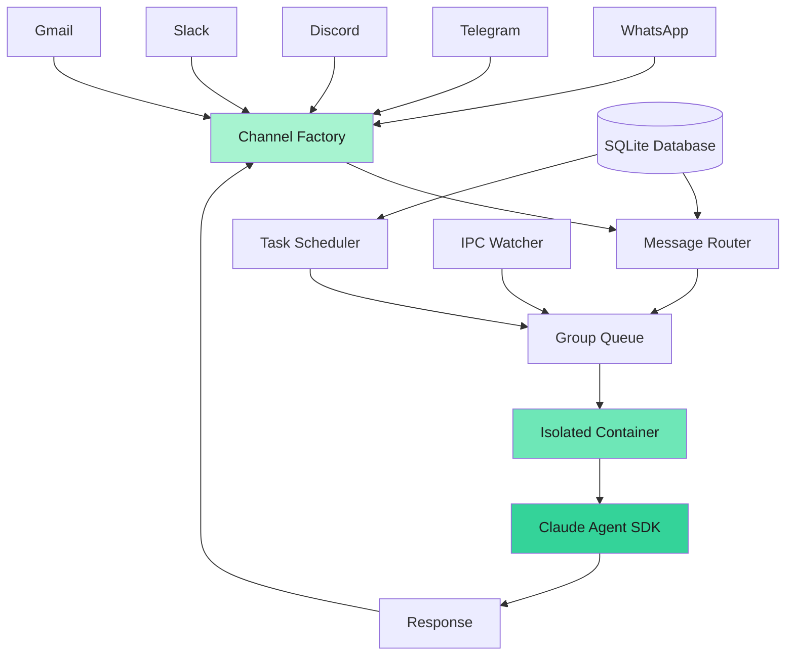
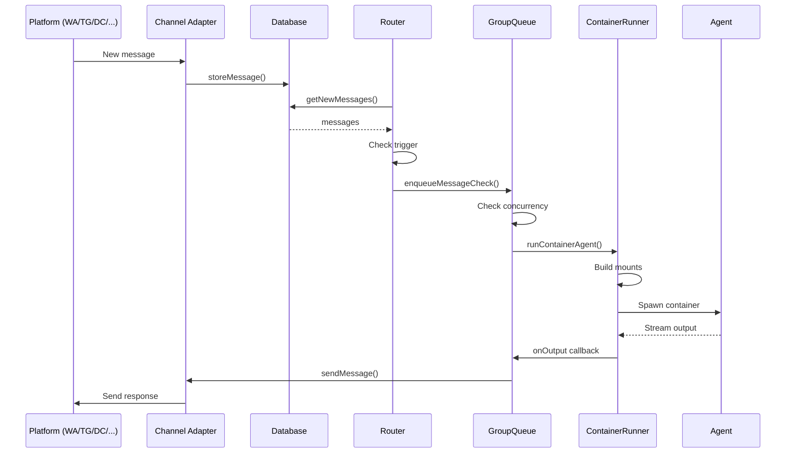
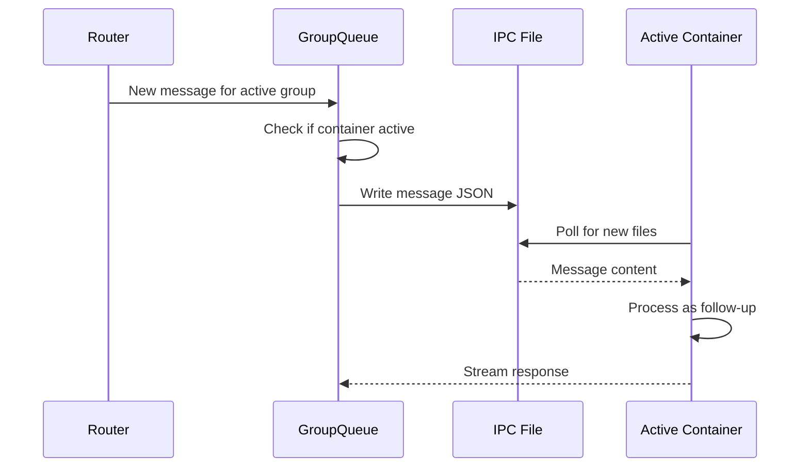

NanoClaw is a lightweight AI assistant that runs Claude Agent SDK in isolated containers. The architecture prioritizes simplicity, security through true isolation, and being small enough to understand completely.

## High-level overview

NanoClaw consists of a single Node.js process that orchestrates everything:



## Core components

### Channel factory

NanoClaw uses a factory registry pattern for messaging channels. Each channel (WhatsApp, Telegram, Discord, Slack, Gmail) self-registers at startup. Channels with missing credentials emit a warning and are skipped — no configuration file is needed to enable or disable channels.

All channels implement a common `Channel` interface for message handling and sending, allowing the rest of the system to be channel-agnostic.

### Message router

The router (`src/index.ts`) is the central orchestrator:

- Polls SQLite database every 2 seconds for new messages
- Filters messages by registered groups only
- Checks for trigger pattern (`@{ASSISTANT_NAME}`)
- Maintains cursor state to track processed messages
- Routes messages to the appropriate group queue

<Info>
The main group (typically your self-chat) doesn't require a trigger - all messages are processed automatically.
</Info>

### Group queue

The GroupQueue (`src/group-queue.ts`) manages container lifecycle and concurrency:

- **Concurrency limiting**: Maximum 5 concurrent containers by default (configurable via `MAX_CONCURRENT_CONTAINERS`)
- **Per-group state**: Each group has a dedicated queue for messages and tasks
- **Retry logic**: Exponential backoff (5s base, up to 5 retries) for failed container runs
- **Idle management**: Keeps containers alive for 30 minutes (default `IDLE_TIMEOUT`) to handle follow-up messages
- **IPC message piping**: Follow-up messages are sent to active containers via IPC files

```typescript
// Queue priority order when draining:
// 1. Pending tasks (won't be re-discovered from DB)
// 2. Pending messages (can be re-fetched from DB)
// 3. Waiting groups (dequeued when slots become available)
```

<Note>
When a container is already active for a group, new messages are piped directly to the running container via IPC instead of spawning a new one.
</Note>

### Container runner

The container runner (`src/container-runner.ts`) spawns and manages isolated agent execution:

**Container lifecycle:**
1. Build volume mounts based on group privileges
2. Spawn container with Docker CLI
3. Pass secrets via stdin JSON (never mounted as files)
4. Stream stdout/stderr for real-time output
5. Parse output markers (`---NANOCLAW_OUTPUT_START---` / `---NANOCLAW_OUTPUT_END---`)
6. Clean up automatically on exit (`--rm` flag)

**Timeout behavior:**
- Hard timeout: `CONTAINER_TIMEOUT` (default 30 minutes)
- Grace period: At least `IDLE_TIMEOUT + 30s` to allow graceful shutdown
- Activity-based reset: Timeout resets on each streaming output
- Post-output timeout: Not considered an error (idle cleanup)

**Logging:**
- All container runs logged to `groups/{name}/logs/container-{timestamp}.log`
- Verbose mode (`LOG_LEVEL=debug`) logs full input/output
- Error runs log input metadata (prompt length, session ID) and full stderr — prompt content is not included

### Task scheduler

The scheduler (`src/task-scheduler.ts`) runs scheduled tasks:

- Polls database every 60 seconds for due tasks
- Supports three schedule types:
  - **cron**: Cron expressions (e.g., `0 9 * * *` for 9am daily)
  - **interval**: Millisecond intervals (e.g., `3600000` for hourly)
  - **once**: ISO timestamp for one-time execution
- Tasks run in group context with full agent capabilities
- Results can be sent to the group chat or completed silently
- Task containers close automatically 10 seconds after producing output

<Accordion title="Task execution flow">
1. Scheduler finds due task from database
2. Enqueues task in GroupQueue (respects concurrency limits)
3. Spawns container in task mode (`isTaskContainer: true`)
4. Streams output and optionally sends to chat via `send_message` tool
5. Logs run to database with duration and result
6. Calculates next run time based on schedule type
7. Container closes after 10-second grace period
</Accordion>

### IPC watcher

The IPC watcher (`src/ipc.ts`) enables container-to-host communication:

- Watches `data/ipc/{group}/messages/*.json` for outbound messages
- Watches `data/ipc/{group}/tasks/*.json` for task operations
- Validates operations against group privileges (see [security.mdx](/concepts/security))
- Atomic file writes (`.tmp` then rename) prevent race conditions
- Each group has isolated IPC namespace

**Available operations:**
- `send_message`: Send message to group chat (own chat only for non-main)
- `schedule_task`, `pause_task`, `resume_task`, `cancel_task`, `update_task`: Task management
- `register_group`, `refresh_groups`: Group management (main only)

### Database

SQLite database (`store/messages.db`) stores:

- **messages**: All messages with timestamps
- **chats**: Chat metadata (name, last activity, is_group)
- **sessions**: Claude session IDs per group folder
- **registered_groups**: Active groups configuration
- **router_state**: Message cursors and last processed timestamps
- **tasks**: Scheduled task definitions
- **task_runs**: Task execution history with duration and results

<Warning>
The database is the source of truth for message history. If you delete it, agents lose access to conversation context.
</Warning>

## Data flow

### Incoming message flow



### Follow-up message flow (piped to active container)



## File system layout

<Tree>
  <Tree.Folder name="nanoclaw" defaultOpen>
    <Tree.Folder name="src" />
    <Tree.Folder name="container" defaultOpen>
      <Tree.File name="Dockerfile" />
      <Tree.Folder name="agent-runner" />
      <Tree.Folder name="skills" />
    </Tree.Folder>
    <Tree.Folder name="groups" defaultOpen>
      <Tree.Folder name="main" defaultOpen>
        <Tree.File name="CLAUDE.md" />
        <Tree.Folder name="logs" />
      </Tree.Folder>
      <Tree.Folder name="{group-name}" />
    </Tree.Folder>
    <Tree.Folder name="data" defaultOpen>
      <Tree.Folder name="sessions" defaultOpen>
        <Tree.Folder name="{group}" defaultOpen>
          <Tree.Folder name=".claude" />
          <Tree.Folder name="agent-runner-src" />
        </Tree.Folder>
      </Tree.Folder>
      <Tree.Folder name="ipc" defaultOpen>
        <Tree.Folder name="{group}" defaultOpen>
          <Tree.Folder name="messages" />
          <Tree.Folder name="tasks" />
          <Tree.Folder name="input" />
        </Tree.Folder>
      </Tree.Folder>
    </Tree.Folder>
    <Tree.Folder name="store" defaultOpen>
      <Tree.File name="messages.db" />
      <Tree.Folder name="auth" />
    </Tree.Folder>
  </Tree.Folder>
</Tree>

## Container image

The agent container (`container/Dockerfile`) includes:

- **Base**: `node:22-slim`
- **Browser**: Chromium with all required dependencies
- **Tools**: `agent-browser` CLI for browser automation
- **Runtime**: `@anthropic-ai/claude-code` (Claude Agent SDK)
- **User**: Runs as `node` user (uid 1000, non-root)
- **Working directory**: `/workspace/group` (group's folder)

<Info>
The container is rebuilt by `./container/build.sh`. Changes to agent-runner code require a rebuild.
</Info>

## Subsystems

### Session management

Each group maintains an isolated Claude conversation session:

- Sessions stored at `data/sessions/{group}/.claude/`
- Include full message history and file contents read
- Auto-compact when context gets too long
- Settings configured per group:
  - `CLAUDE_CODE_EXPERIMENTAL_AGENT_TEAMS=1` (enable subagent orchestration)
  - `CLAUDE_CODE_ADDITIONAL_DIRECTORIES_CLAUDE_MD=1` (load memory from mounts)
  - `CLAUDE_CODE_DISABLE_AUTO_MEMORY=0` (enable persistent memory)

### Skills system

Shared skills in `container/skills/` are synced to each group's `.claude/skills/` on startup:

- Skills are available to all agents
- Per-group copies allow customization without affecting others
- Changes to shared skills require container restart to sync
- Built-in container skills include `/agent-browser` (web automation), `/capabilities` (system introspection), and `/status` (health check)
- `/capabilities` and `/status` are main-channel only — they check for the `/workspace/project` mount to enforce access

### Agent runner customization

Each group gets a writable copy of `agent-runner/src/` at `data/sessions/{group}/agent-runner-src/`:

- Recompiled on every container startup via `entrypoint.sh`
- Allows agents to add custom tools or modify behavior
- Isolated from other groups (changes don't affect them)
- MCP servers can be added by modifying the agent runner code

<Note>
The agent runner is the TypeScript code that wraps Claude Agent SDK. It handles IPC, streaming output, and tool registration.
</Note>

## Startup sequence

1. **Container system check**: Ensure Docker is running, clean up orphaned containers
2. **Database initialization**: Create tables if needed, load schema
3. **State loading**: Restore message cursors, sessions, registered groups
4. **Remote Control restore**: Re-adopt any surviving Remote Control session from a previous run
5. **Channel connection**: Connect to messaging channels, authenticate if needed
6. **Subsystem startup**: 
   - Task scheduler loop (60s interval)
   - IPC watcher (1s poll interval)
   - Message loop (2s poll interval)
7. **Recovery**: Check for unprocessed messages from previous crash
8. **Ready**: System begins processing messages and tasks

## Graceful shutdown

On `SIGTERM` or `SIGINT`:

1. GroupQueue enters shutdown mode (stops accepting new work)
2. Active containers are detached (not killed)
3. Channels disconnect gracefully
4. Process exits with code 0

<Warning>
Containers are intentionally not killed during shutdown to prevent data loss from channel reconnection restarts. They'll finish on their own via idle timeout or container timeout.
</Warning>

## Related topics

- [Security model and isolation](/concepts/security)
- [Group isolation and privileges](/concepts/groups)
- [Container isolation details](/concepts/containers)
- [Scheduled tasks system](/concepts/tasks)
