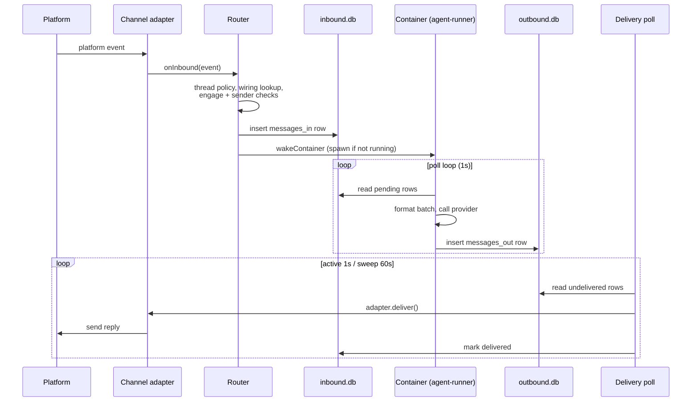

{/* verified-against: src/index.ts, src/router.ts, src/delivery.ts, src/session-manager.ts, src/host-sweep.ts, src/container-runner.ts, src/claude-md-compose.ts, src/webhook-server.ts, container/agent-runner/src/{index,poll-loop,formatter,compact-instructions}.ts @ dc34ceb (v2.1.4) */}

NanoClaw is one Node.js host process plus one Docker container per active session. The host owns the channels, the routing, and the container lifecycle; the agent runs inside the container and never talks to the network on NanoClaw's behalf. Between them sits the core idea: **every message is a row in SQLite**. There is no internal message bus, no RPC, no shared memory — the host writes rows the container reads, the container writes rows the host reads, and everything else is polling.

Each session owns a pair of database files in its session folder:

- `inbound.db` — host writes, container reads. Inbound messages, scheduled tasks, routing defaults.
- `outbound.db` — container writes, host reads. Agent replies, processing acknowledgements, session state.

One writer per file, opposite directions. A crashed container can never corrupt the host's queue, and the host never contends with an agent for a write lock across the Docker mount boundary.

## A message, end to end

Step by step on the inbound side ([`src/router.ts`](https://github.com/qwibitai/nanoclaw/blob/main/src/router.ts)):

1. The adapter normalizes a platform event and hands it to the router (see [Channels overview](/channels/overview) for the adapter side).
2. Non-threaded adapters collapse `threadId` to null; the router looks up the messaging group for `(channel_type, platform_id)`, auto-creating one on a mention or DM. Unwired channels escalate to the owner for approval instead of routing.
3. The sender is resolved to a namespaced user ID, then the message fans out to every wired agent independently: engage mode (`pattern`, `mention`, `mention-sticky`), access gate, and sender scope decide per agent. Agents that decline but have `ignored_message_policy='accumulate'` still get the row stored as silent context (`trigger=0`).
4. For each engaging agent, the router resolves a session (`shared`, `per-thread`, or `agent-shared` — see [Entity model](/concepts/entity-model)), writes the row to that session's `inbound.db`, and wakes the container.

On the outbound side, `src/delivery.ts` drains `messages_out`: an in-flight set prevents the two polls from double-delivering, rows are filtered against the `delivered` table in `inbound.db`, then routed by kind — `system` actions are handled by the host itself, `channel_type='agent'` rows go to the agent-to-agent module, and everything else passes a destination permission check before `adapter.deliver()`. Three failed attempts marks a message permanently failed.

## The host process

`src/index.ts` is a thin orchestrator. What it starts, in order:

1. **Circuit breaker** — backs off on rapid restart loops, then an upgrade tripwire refuses to start if the install was updated outside `/update-nanoclaw`.
2. **Central DB** — opens `data/v2.db`, runs migrations, backfills container configs, and performs the one-time `CLAUDE.local.md` filesystem cutover.
3. **Container runtime** — verifies Docker is running and removes orphan containers from a previous run.
4. **Channel adapters** — every adapter registered via the channel barrel is initialized; adapters with missing credentials are skipped with a warning.
5. **Delivery adapter bridge** — connects the delivery system to the adapter registry for `deliver()` and `setTyping()`.
6. **Delivery polls** — the active poll (1s, sessions with a running container) and the sweep poll (60s, all active sessions).
7. **Host sweep** — the 60-second maintenance loop described below.
8. **`ncl` CLI socket server** — admin commands over a Unix socket at `data/ncl.sock` (see [ncl CLI](/reference/ncl-cli)).

Modules (permissions, scheduling, approvals, agent-to-agent, typing, and so on) self-register through barrel imports before `main()` runs — they hook into the router and delivery pipeline rather than being called by name from core.

<Note>
There is no HTTP API. The webhook server (`src/webhook-server.ts`) starts lazily when the first Chat SDK adapter registers, listens on `WEBHOOK_PORT` (default 3000), and only accepts inbound platform webhooks at `/webhook/{adapter}`. The admin surface is the `ncl` CLI over the Unix socket, not HTTP.
</Note>

## Inside the container

The container runs the **agent-runner** (`container/agent-runner/src/`) directly with Bun — no compile step, since the source is a read-only bind mount at `/app/src`. All IO goes through the session DB pair mounted at `/workspace`; there is no stdin, no stdout markers.

The poll loop (`poll-loop.ts`) drives everything:

- Every second it reads pending `messages_in` rows. Batches containing only `trigger=0` (accumulated context) rows don't wake the agent — they ride along with the next real trigger.
- A batch is marked `processing`, formatted into XML (`<message>`, `<task>`, `<webhook>` blocks with a timezone header — `formatter.ts`), and sent to the provider as one prompt.
- While the query streams, a 500ms follow-up poll pushes newly arrived messages into the open stream instead of restarting the provider subprocess.
- Result text must wrap output in `<message to="name">` blocks; each block becomes a `messages_out` row addressed to a named destination. Bare text is treated as scratchpad and never sent.
- The provider's session ID (continuation) is persisted to `outbound.db` so the next container resumes the conversation, and a `PreCompact` hook injects instructions that preserve routing context through context compaction.
- On every provider event the runner touches `/workspace/.heartbeat` — the host's only liveness signal.

The agent itself talks to NanoClaw through a built-in MCP server (`send_message`, `schedule_task`, `ask_user_question`, and friends — see [MCP tools](/reference/mcp-tools)). The provider behind `provider.query()` is pluggable: Claude Code is the default, and others self-register the same way channels do (see [Providers](/extend/providers)).

## Composed at spawn

The container runner (`src/container-runner.ts`) rebuilds the agent's world on every spawn. Concurrent wakes for the same session are deduplicated through an in-flight promise map, then the runner:

1. Refreshes the session's destination map and default reply routing in `inbound.db`.
2. Materializes `container.json` from the database and syncs skill symlinks to match its selection.
3. **Composes `groups/<folder>/CLAUDE.md`** (`src/claude-md-compose.ts`) and builds the mount list: a generated entry point that begins with `<!-- Composed at spawn — do not edit. Edit CLAUDE.local.md for per-group content. -->` and contains only imports — the shared base (`container/CLAUDE.md`, mounted read-only at `/app/CLAUDE.md`), one fragment per skill that ships `instructions.md`, one per built-in module's MCP tool instructions, and inline instructions from user-added MCP servers. The only file you (or the agent) should edit is `CLAUDE.local.md`, the per-group memory that Claude Code auto-loads alongside it.
4. Wires the OneCLI Agent Vault: `HTTPS_PROXY` plus certificates are injected so API calls are credential-injected in transit. If the vault is unreachable, the spawn fails rather than running without credentials, and the message stays pending for the next sweep.
5. Joins the egress lockdown network when enabled (see [Security model](/concepts/security)) and spawns `docker run`.

The mounts define what the agent can touch: the session folder at `/workspace` (read-write), the group folder at `/workspace/agent` (read-write, with `container.json`, the composed `CLAUDE.md`, and the fragments re-mounted read-only on top), and shared read-only code at `/app/src`, `/app/skills`, and `/app/CLAUDE.md`. [Container lifecycle](/concepts/container-lifecycle) covers spawn-to-exit in detail.

## What runs when

| Loop | Interval | Scope |
|---|---|---|
| Active delivery poll | 1s | Sessions with a running container |
| Container poll loop | 1s (500ms during an active query) | Its own `inbound.db` |
| Sweep delivery poll | 60s | All active sessions (catches replies from containers that already exited) |
| Host sweep | 60s | All active sessions |

The host sweep (`src/host-sweep.ts`) is the system's janitor. After re-healing the egress network, for each active session it:

1. **Syncs `processing_ack`** from `outbound.db` into `messages_in` status, so completed work is recorded on the host side.
2. **Wakes containers for due work** — rows whose `process_after` has elapsed (scheduled tasks, retries) with no container running.
3. **Enforces the running-container SLA** — kills a container whose heartbeat is older than max(30 minutes, its declared Bash timeout), or one that claimed a message and showed no heartbeat for over max(60 seconds, its declared Bash timeout) since the claim.
4. **Cleans up after crashes** — `processing` rows left by a dead container are reset to pending with exponential backoff (5s × 2^tries); after 5 tries a message is marked failed.
5. **Advances recurring tasks** — completed recurring rows are cloned into their next occurrence (see [Scheduled tasks](/guides/scheduled-tasks)).

There is deliberately no wall-clock idle timeout: liveness is judged from the heartbeat file and claim age, so long-running legitimate work is never killed on a timer.

## The two database layers

All persistent state lives in SQLite, split across two layers — the [database schema reference](/reference/db-schema) documents every table.

- **Central database** (`data/v2.db`) — the entity model: agent groups, messaging groups, users, wirings, sessions, approvals. Host-only, opened once, WAL mode.
- **Session pairs** (`data/v2-sessions/<agent_group_id>/<session_id>/`) — `inbound.db` and `outbound.db`, shared with exactly one container via bind mount.

The session pair **is** the host-container IPC system — there is no other channel. Files in `inbox/` and `outbox/` carry attachments alongside their message rows, and `.heartbeat` carries liveness. Three invariants make SQLite safe across a Docker mount (from the comments in `src/session-manager.ts`):

1. **`journal_mode=DELETE`, not WAL** — WAL's memory-mapped `-shm` file doesn't refresh across the host-to-container mount, so a WAL-mode container would silently miss every new message.
2. **The host opens, writes, and closes per operation** — a long-lived host connection would freeze the container's view of the file at first read.
3. **One writer per file** — DELETE-mode journal unlinking isn't atomic across the mount, so concurrent writers would corrupt the database. Hence the split into two files with opposite ownership; the host only writes `outbound.db` when no container is running.

## Related pages

- [Entity model](/concepts/entity-model) — agent groups, messaging groups, wirings, sessions
- [Container lifecycle](/concepts/container-lifecycle) — spawn, heartbeat, kill, and respawn in detail
- [Security model](/concepts/security) — isolation boundaries and egress lockdown
- [Database schema](/reference/db-schema) — every table in `v2.db` and the session pairs
- [Channels overview](/channels/overview) — the adapter side of the inbound path
