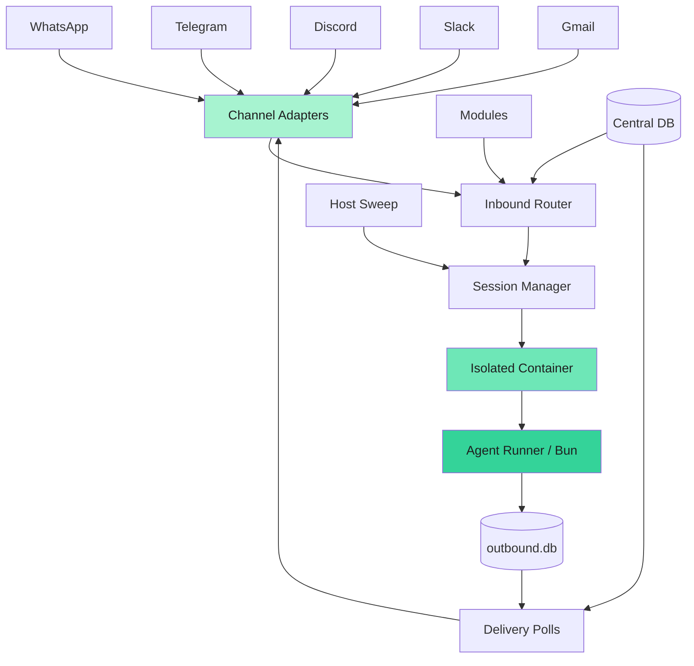
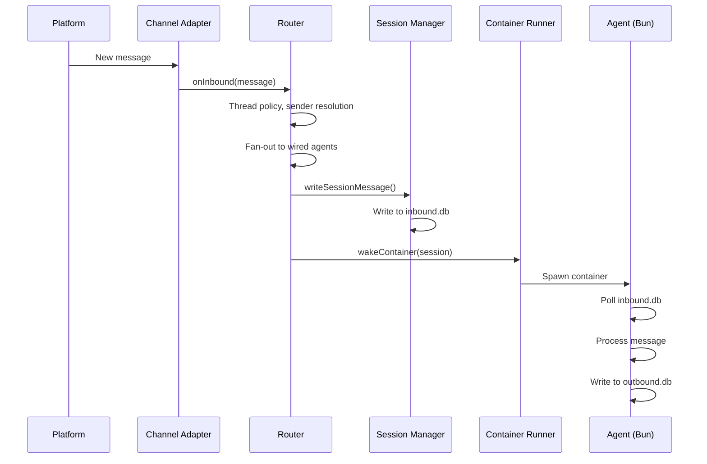
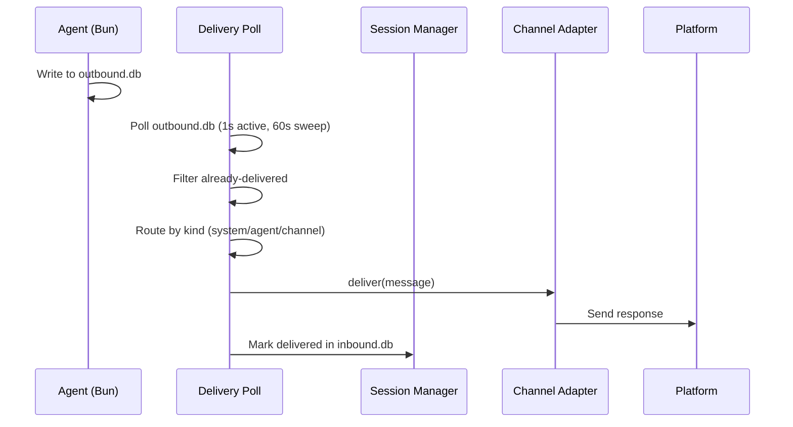

NanoClaw is a lightweight AI assistant that runs agents in isolated containers. The v2 architecture is a ground-up rewrite built on a two-database session model, a pluggable module system, and a new entity model that separates users, agent groups, messaging groups, and wirings.

## High-level overview

NanoClaw consists of a single Node.js host process that orchestrates everything:

## Core components

### Channel adapters

NanoClaw uses a self-registering adapter pattern for messaging channels. Each channel (WhatsApp, Telegram, Discord, Slack, Gmail) registers at startup. Channels with missing credentials are skipped with a warning.

All adapters implement a common interface with `onInbound`, `onInboundEvent`, `onMetadata`, and `onAction` callbacks, allowing the rest of the system to be channel-agnostic.

### Inbound router

The router (`src/router.ts`) is the central message routing pipeline:

1. **Thread policy** — non-threaded adapters (Telegram, WhatsApp, iMessage) collapse `threadId` to null
2. **Messaging group lookup** — finds or auto-creates messaging groups on mentions/DMs
3. **Unwired channel handling** — if no agents are wired, the channel-request gate escalates to the owner for approval
4. **Sender resolution** — the permissions module extracts namespaced user IDs and upserts users
5. **Fan-out** — each wired agent is evaluated independently against engage mode, sender scope, and access gates
6. **Engage evaluation** — per-agent decision based on `pattern`, `mention`, or `mention-sticky` mode
7. **Delivery** — engaging agents get a session wake and container spawn; non-engaging agents with `accumulate` policy store the message for future context

<Info>
Message IDs are namespaced by agent group ID to prevent collisions during fan-out to multiple agents.
</Info>

### Session manager

The session manager (`src/session-manager.ts`) manages the two-database session model:

- **Session resolution** — `shared` (one per messaging group), `per-thread` (one per thread), or `agent-shared` (one per agent group)
- **Two-DB split** — each session has an `inbound.db` (host writes, container reads) and `outbound.db` (container writes, host reads)
- **Cross-mount invariants** — `journal_mode=DELETE` (WAL doesn't refresh across Docker mounts), host opens-writes-closes per operation, one writer per file

<Warning>
The two-DB split is critical for correctness. SQLite WAL mode's memory-mapped shared memory file doesn't refresh across Docker bind mounts, so `journal_mode=DELETE` is required.
</Warning>

### Container runner

The container runner (`src/container-runner.ts`) spawns and manages isolated agent execution:

- **Wake deduplication** — concurrent wake calls for the same session are deduplicated via an in-flight promise map
- **Per-agent-group images** — custom Docker images with additional apt/npm packages can be built per agent group
- **Shared source** — `/app/src` is a read-only bind mount from the host; source changes never require an image rebuild
- **No stdin/stdout** — all IO is via the two-DB split; no stdin piping or output markers

### Delivery system

The delivery system (`src/delivery.ts`) uses a two-poll architecture:

- **Active poll** (1s) — polls `outbound.db` for all running-container sessions
- **Sweep poll** (60s) — polls all active sessions, catching messages from containers that exited between active polls
- **Delivery pipeline** — routes based on message kind (`system`, `agent`, or channel), with permission checks for cross-channel delivery
- **Retry** — 3 attempts per message, then permanently failed

<Note>
Deduplication via an in-flight set prevents double-delivery when both polls hit the same session simultaneously.
</Note>

### Host sweep

The host sweep (`src/host-sweep.ts`) runs every 60 seconds:

- Syncs `processing_ack` from `outbound.db` to update inbound message status
- Detects stale containers via heartbeat mtime and processing_ack age
- Wakes containers for due messages (scheduled tasks with `process_after <= now`)
- Advances recurring task series (creates next-occurrence rows)

### Database

**Central database** (`data/v2.db`) stores the entity model:

- **agent_groups** — workspaces with folder, name, and optional provider
- **messaging_groups** — platform chats with `unknown_sender_policy` (`strict`, `request_approval`, or `public`)
- **messaging_group_agents** — many-to-many wirings with engage mode, pattern, sender scope, ignored message policy, session mode, and priority
- **users** — namespaced platform identifiers (e.g., `phone:+1555...`, `tg:123`, `discord:456`)
- **user_roles** — owner (always global) or admin (global or scoped to agent group)
- **sessions** — status tracking for both session and container

**Session inbound.db** (host writes, container reads):

- **messages_in** — inbound messages with status, `process_after`, recurrence, `series_id`, and trigger flag
- **delivered** — tracks delivery outcomes
- **destinations** — live destination map (channels and other agents)
- **session_routing** — default reply routing

**Session outbound.db** (container writes, host reads):

- **messages_out** — outbound messages with `deliver_after` and recurrence
- **processing_ack** — tracks which inbound messages the container has processed
- **session_state** — persistent key/value store (e.g., SDK session ID for resume)
- **container_state** — tool-in-flight state for stuck-detection

### Module system

Modules self-register via barrel imports and provide optional hooks into the router and delivery pipeline:

- **Permissions** — sender resolution, access gating, channel approval, sender approval
- **Scheduling** — task creation, pause/resume/cancel/update via delivery actions
- **Agent-to-agent** — cross-agent message routing
- **Approvals** — interactive question cards
- **Self-mod** — agent self-modification requests
- **Typing** — typing indicator management

## Data flow

### Incoming message flow

### Outbound delivery flow

## File system layout

<Tree>
  <Tree.Folder name="nanoclaw" defaultOpen>
    <Tree.Folder name="src" />
    <Tree.Folder name="container" defaultOpen>
      <Tree.File name="Dockerfile" />
      <Tree.Folder name="agent-runner" />
      <Tree.Folder name="skills" />
    </Tree.Folder>
    <Tree.Folder name="groups" defaultOpen>
      <Tree.Folder name="main" defaultOpen>
        <Tree.File name="CLAUDE.md" />
      </Tree.Folder>
      <Tree.Folder name="global" defaultOpen>
        <Tree.File name="CLAUDE.md" />
      </Tree.Folder>
      <Tree.Folder name="{agent-group}" />
    </Tree.Folder>
    <Tree.Folder name="data" defaultOpen>
      <Tree.File name="v2.db" />
      <Tree.Folder name="v2-sessions" defaultOpen>
        <Tree.Folder name="{agent_group_id}" defaultOpen>
          <Tree.Folder name="{session_id}" defaultOpen>
            <Tree.File name="inbound.db" />
            <Tree.File name="outbound.db" />
            <Tree.Folder name="outbox" />
            <Tree.Folder name="inbox" />
            <Tree.File name=".heartbeat" />
          </Tree.Folder>
        </Tree.Folder>
      </Tree.Folder>
    </Tree.Folder>
  </Tree.Folder>
</Tree>

## Container image

The agent container (`container/Dockerfile`) includes:

- **Base**: `node:22-slim`
- **Runtime**: Bun (runs agent-runner TypeScript directly, no compilation)
- **Browser**: Chromium with all required dependencies
- **Tools**: `agent-browser`, `vercel` CLI, `curl`, `git`
- **SDK**: `@anthropic-ai/claude-code` (Claude Agent SDK)
- **PID 1**: `tini` for proper signal forwarding
- **User**: Runs as `node` user (uid 1000, non-root)
- **Working directory**: `/workspace/group`

<Info>
Source code is NOT baked into the image. `/app/src` is a read-only bind mount from the host, so source-only changes never require an image rebuild.
</Info>

## Startup sequence

1. **Central DB initialization** — opens `data/v2.db`, runs migrations, performs one-time filesystem cutover
2. **Container runtime check** — ensures Docker is running, cleans up orphan containers carrying this install's `nanoclaw-install=<slug>` label (peer installs on the same host are left untouched)
3. **Channel adapter initialization** — registers all channel adapters with `onInbound`, `onInboundEvent`, `onMetadata`, and `onAction` callbacks
4. **Delivery adapter bridge** — bridges the delivery system to channel adapters for `deliver()` and `setTyping()` calls
5. **Delivery polls** — starts active poll (1s for running containers) and sweep poll (60s for all active sessions)
6. **Host sweep** — 60s sweep for processing_ack sync, stale detection, due-message wake, and recurrence advancement

## Graceful shutdown

On `SIGTERM` or `SIGINT`:

1. Registered shutdown callbacks execute in order
2. Delivery polls stop
3. Channel adapters tear down gracefully
4. Process exits

<Warning>
Modules and channel adapters register their own shutdown callbacks. The shutdown sequence is determined by registration order.
</Warning>

## Related topics

- [Security model and isolation](/concepts/security)
- [Group isolation and privileges](/concepts/groups)
- [Container isolation details](/concepts/containers)
- [Scheduled tasks system](/concepts/tasks)
