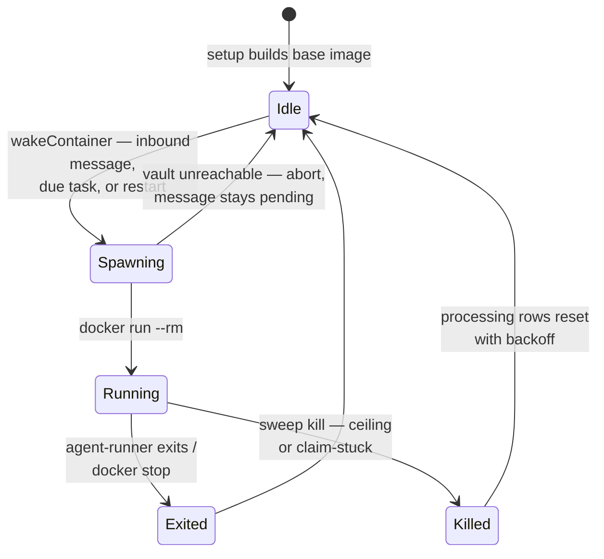

{/* verified-against: src/container-runner.ts, src/container-runtime.ts, src/egress-lockdown.ts, src/host-sweep.ts, src/install-slug.ts, setup/container.ts, container/Dockerfile @ dc34ceb (v2.1.4) */}

Every active session gets exactly one Docker container, spawned on demand and killed when it goes quiet. The container is deliberately disposable: all state lives in mounted host directories, so a kill loses nothing but an in-flight provider call — and the [host sweep](/concepts/architecture#what-runs-when) retries that.

Docker is the only supported runtime. All runtime-specific logic lives in a single file (`src/container-runtime.ts`, with the binary hardcoded to `docker`), so a future runtime swap means changing one file — but today there is no Apple Container, no micro-VM, no alternative backend.

## The image

Setup builds one base image per install from `container/Dockerfile` (see [Installation](/installation)). It's tagged `nanoclaw-agent-v2-<slug>:latest`, where the slug is the first 8 hex characters of `sha1(projectRoot)` — two NanoClaw checkouts on one host get distinct images and never clobber each other. What's inside:

- **`node:22-slim`** base with **Bun** as the agent-runner's runtime — TypeScript runs directly, no compile step
- **`tini`** as the image's default entrypoint — though production spawns override the entrypoint entirely, so Bun runs as PID 1 (see the spawn section below)
- **Chromium** plus its library stack for browser automation (`agent-browser` drives it; CJK fonts are an opt-in `INSTALL_CJK_FONTS=true` build arg)
- **Pinned global CLIs** via pnpm — `@anthropic-ai/claude-code`, `agent-browser`, and `vercel`, each pinned to an exact version. The versions live in `container/cli-tools.json`; `install-cli-tools.sh` reads that manifest and runs `pnpm install -g` for each entry, so a skill adds a CLI by appending to the manifest instead of editing the Dockerfile

The agent-runner source is **never baked in** — the host bind-mounts it read-only at `/app/src` on every spawn, so source changes never require a rebuild. Rebuilds are only for the Dockerfile itself, CLI version bumps, or agent-runner dependency changes — `package.json` and `bun.lock` are copied in and `bun install`ed at build time.

When a group installs apt or npm packages, the host generates a Dockerfile `FROM` the base image, builds it as `nanoclaw-agent-v2-<slug>:<agent-group-id>`, and stores the tag in the group's config — that group spawns from its custom image from then on. Mechanics in [Container configuration](/reference/container-config#per-group-images-and-packages).

## The lifecycle

### Wake — deduplicated, never throws

`wakeContainer(session)` fires when the router writes an inbound message, when the host sweep finds due work (scheduled tasks, retries) with no container running, or on an explicit `ncl groups restart`. Two layers prevent duplicates against the same session directory:

1. An **`activeContainers` map** keyed by session ID — if a container is already running, wake is a no-op.
2. An **in-flight promise map** — a second wake arriving while the first spawn is still mid-setup (vault wiring, mount assembly) joins the existing promise instead of spawning a racy double.

Wake never throws. A transient spawn failure — most commonly the OneCLI vault being unreachable — returns `false`, the inbound row stays pending, and the next sweep tick retries.

### Spawn — the world rebuilt every time

Before `docker run`, the runner reassembles everything the agent sees: it refreshes the session's destination map and reply routing, materializes `container.json` from the database, syncs skill symlinks to match the config, composes the group's `CLAUDE.md` from base + fragments (details in [Architecture](/concepts/architecture#composed-at-spawn)), and deletes any stale heartbeat file from a previous container so the sweep gives the new one fresh grace.

The exact mounts, from `buildMounts` in `src/container-runner.ts`:

| Host path | Container path | Mode |
|---|---|---|
| `data/v2-sessions/<group>/<session>/` | `/workspace` | RW — `inbound.db`, `outbound.db`, `outbox/`, `.heartbeat` |
| `groups/<folder>/` | `/workspace/agent` | RW — working files, `CLAUDE.local.md` |
| `groups/<folder>/container.json` | `/workspace/agent/container.json` | RO, nested over the RW group dir |
| `groups/<folder>/CLAUDE.md` (composed) | `/workspace/agent/CLAUDE.md` | RO, nested — regenerated each spawn |
| `groups/<folder>/.claude-fragments/` | `/workspace/agent/.claude-fragments` | RO, nested |
| `groups/global/` | `/workspace/global` | RO — dead code as of v2.1.4\* |
| `container/CLAUDE.md` | `/app/CLAUDE.md` | RO — shared base instructions |
| `data/v2-sessions/<group>/.claude-shared/` | `/home/node/.claude` | RW — Claude state, settings, skill symlinks |
| `container/agent-runner/src/` | `/app/src` | RO — agent-runner source |
| `container/skills/` | `/app/skills` | RO — shared skills |
| `additional_mounts` entries | `/workspace/extra/<name>` | Per config, allowlist-validated |

\* The `groups/global/` mount is dead code as of v2.1.4: `migrateGroupsToClaudeLocal()` (`src/claude-md-compose.ts`) deletes `groups/global/` at every host startup, so the existence check in `buildMounts` never passes and `/workspace/global` never materializes. The shared base now lives in `container/CLAUDE.md`, mounted at `/app/CLAUDE.md`.

Providers can contribute extra mounts and env vars (for example OpenCode's XDG directories); these are appended last. The nested read-only mounts matter: the group dir is read-write, but `container.json`, the composed `CLAUDE.md`, and the fragments are re-mounted read-only on top, so the agent can read its config and instructions but not rewrite them. `CLAUDE.local.md` stays the one writable memory file.

The `docker run` invocation itself: `--rm` (self-removing), a name of `nanoclaw-v2-<folder>-<timestamp>`, the install label `nanoclaw-install=<slug>`, and `TZ` as the only env var NanoClaw always sets — everything else the runner needs comes from `container.json`. The OneCLI Agent Vault then injects `HTTPS_PROXY` and certificates so the agent's API calls get credentials in transit; if the vault can't be wired, the spawn aborts rather than running credential-less. When the host user isn't uid 0 or 1000, the container runs `--user <hostUid>:<hostGid>` so mounted files keep sane ownership, with `HOME=/home/node` set alongside. The image is the group's `image_tag` if set, otherwise the base — and the image's tini entrypoint is **overridden**: the runner passes `--entrypoint bash` with `-c 'exec bun run /app/src/index.ts'`, so bash `exec`s into Bun and **Bun is PID 1** (there's no `--init` flag either).

When egress lockdown is enabled (`NANOCLAW_EGRESS_LOCKDOWN=true`), the container joins a Docker `--internal` network with the vault gateway as the only reachable hop — no internet route exists, and the agent runs non-root without `NET_ADMIN`, so it can't undo it. If lockdown is on but can't be established, the spawn fails rather than running with open egress. Setup in [Hardening](/operate/hardening#lock-down-network-egress).

### Running

Bun runs the agent-runner as PID 1 (the spawn's entrypoint override bypasses the image's tini); the runner polls `inbound.db` and touches `/workspace/.heartbeat` on every provider event — the host's only liveness signal. Container stderr is streamed into the host log at debug level; stdout is unused, since all IO is database rows. There is deliberately **no wall-clock idle timeout** on the host side.

### Death

The host sweep kills a running container under exactly two conditions — both heartbeat-driven and documented with the rest of the sweep in [Architecture](/concepts/architecture#what-runs-when):

- **Absolute ceiling** — no heartbeat for longer than max(30 minutes, the container's declared Bash timeout).
- **Claim-stuck** — a message was claimed and the container showed no heartbeat for over max(60 seconds, declared Bash timeout) since the claim.

A kill is `docker stop -t 1` — SIGTERM delivered directly to Bun as PID 1, with one second to finalize DB writes before Docker escalates — and a host-side SIGKILL as fallback if the stop command itself fails. On any exit — clean or killed — the close handler removes the session from the active map, marks the container stopped, and logs `Container exited` with the exit code. Orphaned `processing` rows are reset to pending with exponential backoff; after 5 tries a message is marked failed.

At host startup, `cleanupOrphans` stops any containers left over from a previous run — filtered by the `nanoclaw-install=<slug>` label, so a second NanoClaw install on the same machine can never reap this install's containers, nor vice versa.

## What the boundary holds

The container sees only the mount table above — no host home directory, no `.ssh`, and **no raw credentials**: API keys live in the OneCLI Agent Vault on the host and are injected into HTTPS requests in transit, so a fully compromised agent has nothing to exfiltrate but its own workspace. Additional mounts must pass the allowlist at `~/.config/nanoclaw/mount-allowlist.json` (no allowlist means none are permitted), and egress lockdown closes the remaining hole — by default the agent has open internet access through the proxy. See [Hardening](/operate/hardening) for locking both down and [Credentials](/operate/credentials) for how vault injection works.

## Related pages

- [Architecture](/concepts/architecture) — the host sweep, CLAUDE.md composition, and the two-database transport
- [Container configuration](/reference/container-config) — every config field consumed at spawn
- [Isolation levels](/concepts/isolation-levels) — what session and group boundaries do and don't separate
- [Security model](/concepts/security) — the threat model behind these boundaries
