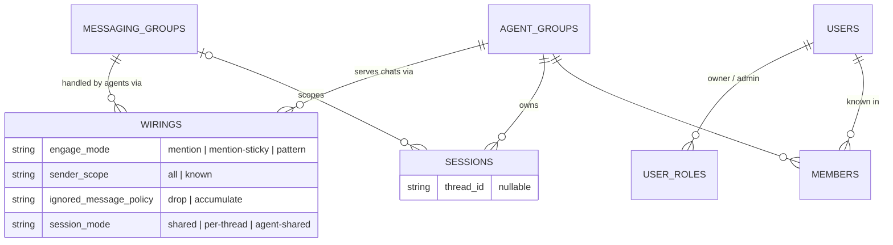

{/* verified-against: src/db/schema.ts, src/db/migrations/{010-engage-modes,011-pending-sender-approvals,012-channel-registration,016-messaging-group-instance}.ts, src/types.ts, src/router.ts, src/session-manager.ts, src/modules/permissions/{index.ts,access.ts}, src/command-gate.ts @ 435233a (v2.1.15) */}

Everything NanoClaw does reduces to five entities in `data/v2.db`: **agent groups** (where agents run), **messaging groups** (where people talk), **wirings** (the edge connecting them, which holds all the behavior), **users** (who is allowed to do what), and **sessions** (the conversation state in between). This page is the mental model; for column-level detail see the [database schema](/reference/db-schema).

## Agent groups — the unit of isolation

An agent group is a workspace: a folder under `groups/<name>/` with its own working files, per-group memory (`CLAUDE.local.md`), a composed `CLAUDE.md`, and a container configuration (the `container_configs` table — packages, mounts, model and skills config). Every session an agent group owns runs in a container that sees only that workspace. All agent groups are equal — privilege lives on users, not on groups.

## Messaging groups — a platform conversation

A messaging group is one chat or channel on one platform, identified by `(channel_type, platform_id, instance)` — a Discord channel, a WhatsApp group, a DM. The `instance` names the adapter that owns the chat, so running several adapters of one platform (say three Slack apps in one workspace) keeps their chats distinct; it defaults to the channel type, so single-instance installs effectively key on `(channel_type, platform_id)` as before. It carries an `unknown_sender_policy` (`strict` / `request_approval` / `public`) and can be denied (`denied_at`), after which messages from it drop silently.

You don't pre-register these. When a mention or DM arrives on a chat NanoClaw has never seen, the router auto-creates the row with `unknown_sender_policy = 'request_approval'` — and if no agent is wired to it, escalates to an approver (group admins first, then global admins, then owners) with an approve/deny card before any agent responds. Plain chatter in unwired channels is ignored entirely.

## Wirings — where the behavior lives

A wiring (`messaging_group_agents` row) connects one messaging group to one agent group. It's many-to-many: one chat can feed several agents, one agent can serve several chats. The wiring — not the agent, not the chat — holds the four orthogonal behavior axes:

### `engage_mode` — when the agent wakes

| Mode | Fires when |
|---|---|
| `mention` | The bot is mentioned at the platform level (`@botname` on Telegram, user-id mention on Slack/Discord). Resolved by the adapter, not by text matching. DMs count as addressed to the bot. |
| `mention-sticky` | A platform mention, **or** a session already exists for this (agent, chat, thread). The session's existence is the subscription: once a mention activates a thread, follow-ups fire without re-mentioning. On threaded platforms the adapter also subscribes to the thread. DMs never stick without a mention. |
| `pattern` | The message text matches the `engage_pattern` regex. `'.'` is the sentinel for "every message" — the always-on flavor. An invalid regex fails open so you notice and fix it. |

<Warning>
The agent's NanoClaw display name is **irrelevant** to engagement. Typing an agent's name in chat does nothing — `mention` mode only responds to real platform mentions of the bot account. To disambiguate multiple agents wired to one chat, give each a `pattern` wiring with its name as the regex.
</Warning>

### `sender_scope` — who can trigger it

`all` lets any sender through; `known` requires the sender to be an owner, admin, or member of the wired agent group. This is per-wiring and stricter than the messaging group's `unknown_sender_policy` — you can require known senders even in a `public` chat.

### `ignored_message_policy` — what happens to everything else

When a message doesn't engage a wiring, `drop` skips it silently. `accumulate` still writes it into the agent's session as non-waking context (`trigger = 0`): the container isn't started, but the next time the agent does engage, it sees the conversation that happened in between. Messages refused by the access or sender-scope gate are never accumulated — that refusal is a security decision, not a missed trigger.

### `session_mode` — how conversations map to sessions

`shared` (one session for the whole chat), `per-thread` (one per thread), or `agent-shared` (one session for the entire agent group, across every chat wired with this mode — useful when GitHub and Slack should land in the same conversation).

## Sessions — the conversation state

A session is one conversation between an agent group and a messaging group (optionally scoped to a thread): one folder under `data/v2-sessions/`, one pair of inbound/outbound databases, and one container while running. The wiring's `session_mode` decides the lookup key, but the router applies two overrides based on what the adapter can do:

1. **Thread-capable adapters force `per-thread` in group chats.** On Discord, Slack, or Teams channels, every thread gets its own session even if the wiring says `shared` — only `agent-shared` overrides this, because it's a cross-channel directive the adapter knows nothing about. DMs are exempt: sub-threads in a DM collapse into one conversation (for `shared` wirings — an explicit `per-thread` wiring is honored in DMs, as the table shows).
2. **Thread-less adapters collapse `per-thread` to `shared`.** WhatsApp, Telegram, and iMessage have no thread IDs — the router nulls the thread before routing, and a `per-thread` lookup with no thread is identical to `shared`.

What you set versus what you actually get:

| Wiring `session_mode` | Threaded adapter, group chat | Threaded adapter, DM | Thread-less adapter |
|---|---|---|---|
| `shared` | `per-thread` (forced) | `shared` | `shared` |
| `per-thread` | `per-thread` | `per-thread` | `shared` (collapses) |
| `agent-shared` | `agent-shared` | `agent-shared` | `agent-shared` |

## Users, roles, and members

A user is a namespaced platform identifier: `channel_type:handle` — `discord:123456`, `slack:U0ABC`, `phone:+15551234567`, `email:a@x.com`. The `kind` column is the channel type. One human with accounts on three platforms is three user rows; there's no cross-channel identity linking yet.

Privilege is user-level, granted in `user_roles`:

- **Owner** — always global. Full access to every agent group, and the last-resort approver for channel registrations (cards go to group admins first, then global admins, then owners).
- **Admin** — global, or scoped to one agent group. Admins pass the command gate (`/clear`, `/compact`, `/context`, `/cost`, `/files`, `/upload-trace` require owner or admin), approve unknown senders within their scope, and are implicitly members of the groups they administer.
- **Member** — a row in `agent_group_members`. Being "known" in an agent group is what lets an unprivileged user interact with it at all.

Access checks walk exactly this chain: owner → global admin → admin of this group → member → denied.

## Sender policies

Each messaging group's `unknown_sender_policy` decides what happens when someone outside that chain writes in: `strict` drops silently, `request_approval` drops and DMs an approval card to an admin (approve makes them a member and replays the message), `public` lets anyone through. Full details, including auditing dropped messages, are in [hardening](/operate/hardening#restrict-who-can-talk-to-your-agents).

## Related pages

- [Database schema](/reference/db-schema) — every column, default, and migration behind these tables
- [Channels overview](/channels/overview) — how to create wirings with `/manage-channels` and `ncl wirings`
- [Architecture](/concepts/architecture) — how the router moves a message through this model end to end
- [Multi-agent swarm](/guides/multi-agent-swarm) — agent-to-agent messaging on top of agent groups
