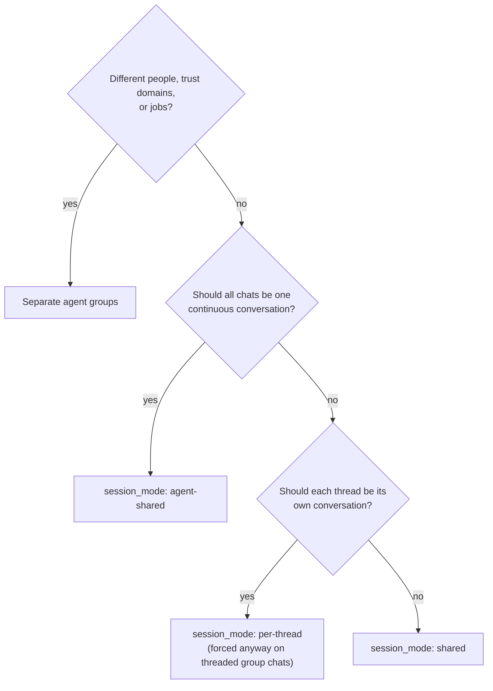

{/* verified-against: src/session-manager.ts, src/router.ts, src/container-runner.ts, .claude/skills/manage-channels/SKILL.md, src/cli/resources/wirings.ts @ e3986eb (v2.1.16) */}

Every time you wire a chat to an agent, you answer one question: should this conversation share anything with the others? NanoClaw gives you four levels, built from two dials in the [entity model](/concepts/entity-model) — which agent group the wiring points at, and the wiring's `session_mode`. This page walks them from most to least isolated.

| Level | Conversation history | Files & memory | Container config & credentials |
|---|---|---|---|
| Separate agent groups | Separate | Separate | Separate |
| One group, session per chat (`shared`) | Separate | **Shared** | Shared |
| One group, session per thread (`per-thread`) | Separate per thread | **Shared** | Shared |
| One conversation (`agent-shared`) | One for everything | Shared | Shared |

## Separate agent groups — nothing shared

Each agent group is its own world: a workspace folder under `groups/<folder>/`, its own per-group memory (`CLAUDE.local.md`), its own composed `CLAUDE.md`, its own container config (packages, mounts, model, skills), and its own Agent Vault credential scope — the OneCLI agent identifier *is* the agent group id, so secrets granted to one group never reach another. Sessions of different groups share only the host and the read-only pieces every container gets: the shared base instructions (`container/CLAUDE.md`, mounted at `/app/CLAUDE.md`) plus the agent-runner source and skills.

Choose this when:

- **Different people.** A family chat and a client channel should not be one agent — a prompt-injected message in one must have nothing to exfiltrate from the other.
- **Different trust domains.** An agent with a mounted code repo and deploy credentials versus an agent that talks to strangers in a public channel.
- **Different jobs.** A research agent and a home-automation agent want different packages, models, and instructions anyway.

## One agent group, a session per chat — `shared`

`session_mode: 'shared'` gives each wired chat its own session: its own conversation history, its own session folder and databases, its own container while running. The agent in chat A cannot read what was said in chat B. Same brain, separate conversations — right for one assistant serving several chats that shouldn't see each other's context.

<Warning>
Conversations are isolated; the **filesystem is not**. Every session of an agent group mounts the same group folder read-write at `/workspace/agent` — working files and `CLAUDE.local.md` memory included. A file the agent saves while talking in chat A is readable (and mentionable) while talking in chat B, and a memory note written in one conversation shapes all of them. If the people in one chat must never see artifacts from another, separate sessions are not enough — use separate agent groups.
</Warning>

## A session per thread — `per-thread`

The same idea at finer grain: one session per `(chat, thread)`, so each Discord or Slack thread is its own conversation. You rarely set this by hand — on thread-capable adapters the router **forces** per-thread in group chats regardless of a `shared` wiring (only `agent-shared` overrides it), DM sub-threads collapse into one session (for `shared` wirings — an explicit `per-thread` wiring is honored in DMs), and thread-less adapters like WhatsApp or Telegram collapse `per-thread` back to `shared`. The full requested-versus-effective table is in the [entity model](/concepts/entity-model)'s sessions section. The shared-filesystem caveat above applies here identically.

## One conversation everywhere — `agent-shared`

`session_mode: 'agent-shared'` is the deliberate opposite of isolation: every messaging group wired with this mode joins the agent group's single session. Mention the agent on Slack, continue on Discord, and it's the same conversation with the same context. Use it when the chats are really one stream — your own DMs across three platforms, or a GitHub webhook channel plus the Slack channel where you discuss it. Don't use it across chats with different audiences: everyone in every wired chat is effectively in one room.

## Choosing a level



When in doubt, start more isolated. Merging two agent groups later means hand-carrying files and memory; splitting one is just creating a new group.

## Configuring each level

The conversational route is the `/manage-channels` skill — it asks exactly this isolation question when you wire a channel and picks the flags for you. With the [`ncl` CLI](/reference/ncl-cli):

```bash
# Most isolated: a new agent group, then wire the chat to it
ncl groups create --name "Work" --folder work
ncl wirings create --messaging-group-id <mg-id> --agent-group-id <new-group-id>

# Same agent, separate conversations (default)
ncl wirings create --messaging-group-id <mg-id> --agent-group-id <ag-id> --session-mode shared

# One conversation across every chat wired this way
ncl wirings create --messaging-group-id <mg-id> --agent-group-id <ag-id> --session-mode agent-shared
```

`--session-mode` is updatable (`ncl wirings update --id <id> --session-mode ...`), but it only changes how *future* messages find a session — existing sessions keep their history where it is.

## What no level isolates

Session and agent-group boundaries separate agents from each other, not from the world:

- **The container boundary** is what stands between an agent and the host — see [container lifecycle](/concepts/container-lifecycle) for what's mounted where and why.
- **Network egress and additional mounts** are per-group container config and open by default beyond the proxy — lock them down in [hardening](/operate/hardening).
- **Shared base instructions** — every container, in every group, mounts the same read-only `container/CLAUDE.md` at `/app/CLAUDE.md`, alongside the shared agent-runner source and skills. Anything written there reaches all agents; per-group instructions belong in that group's `CLAUDE.local.md`.

## Related pages

- [Entity model](/concepts/entity-model) — the five entities these levels are built from
- [Channels overview](/channels/overview) — wiring chats with `/manage-channels`
- [Hardening](/operate/hardening) — egress, mounts, sender policies, the command gate
- [Container lifecycle](/concepts/container-lifecycle) — the per-session container and its mounts
