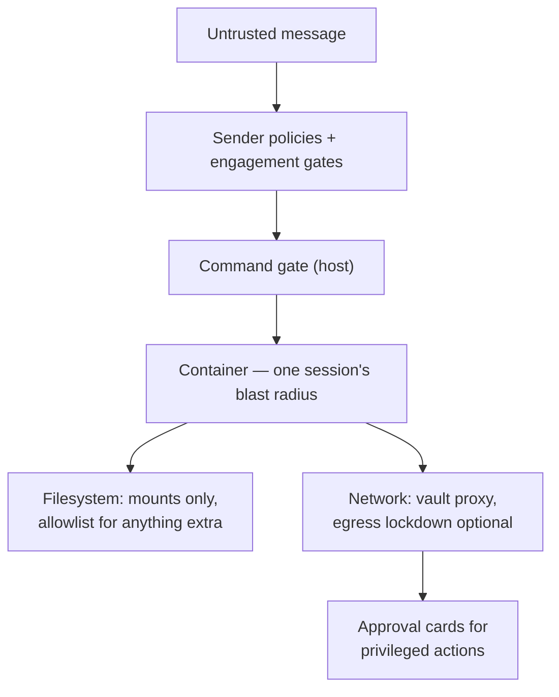

{/* verified-against: src/container-runner.ts, src/egress-lockdown.ts, src/inbox-safety.ts, src/session-manager.ts, src/modules/mount-security/index.ts, src/command-gate.ts, src/modules/permissions/{index.ts,access.ts,channel-approval.ts,sender-approval.ts}, src/modules/approvals/{index.ts,primitive.ts,onecli-approvals.ts,reason-capture.ts,finalize.ts,response-handler.ts}, src/modules/agent-to-agent/{message-gate.ts,agent-route.ts,db/agent-message-policies.ts}, src/modules/self-mod/index.ts, container/Dockerfile, pnpm-workspace.yaml, docs/SECURITY.md @ e926e30e (v2.1.53) */}

NanoClaw connects an AI agent with real tools — a shell, a filesystem, network access — to chat platforms where anyone can type. Every inbound message is untrusted input fed straight into the model's context, and no model reliably distinguishes "instructions from my operator" from "instructions an attacker pasted into the group chat." So the design assumption is blunt: **prompt injection eventually succeeds, and the agent acts as if the attacker wrote its instructions.**

Everything below answers the question that assumption forces: *what can a fully compromised agent actually do?* Each layer shrinks that answer. This page is the why; the configuration lives in [Hardening](/operate/hardening) and [Credentials](/operate/credentials).

## Container isolation — the blast radius is one session

A compromised agent is a compromised *container*, and every active session gets its own. The container runs as the unprivileged `node` user (or your host uid/gid), with no added Linux capabilities, and `--rm` so nothing persists past exit. Its filesystem view is exactly the [mount table](/concepts/container-lifecycle#spawn--the-world-rebuilt-every-time): the session folder, the group workspace, and read-only shared code. No host home directory, no `.ssh`, no Docker socket. Its own `container.json` and composed `CLAUDE.md` are re-mounted read-only on top of the writable workspace, so the agent can read its configuration but not rewrite it to grant itself more.

The container is also disposable by design — the host kills it on a stale heartbeat and rebuilds the entire environment at next spawn, so a compromised process doesn't outlive its session. See [Container lifecycle](/concepts/container-lifecycle).

Files flow *into* the container too — channel attachments and files forwarded from other agents are written by the **host** into the session's writable `inbox/`. That's a classic symlink trap: a compromised agent could replace its inbox with a symlink and redirect the host's write anywhere the host can reach. The shared inbox guard (`src/inbox-safety.ts`) closes it — before any write, the host verifies the inbox root and the per-message directory are real directories (not symlinks), resolves the final path, and refuses anything that lands outside the session folder; the writes themselves use exclusive-create flags so a pre-placed symlinked *file* can't be followed either.

## No raw credentials in containers

The single most valuable thing to exfiltrate from an agent is an API key, so the invariant is that there are none: secrets live in the OneCLI Agent Vault on the host, and the vault's gateway injects them into outbound HTTPS requests in transit. Where a tool insists on finding a credential file locally, it gets a stub whose secret value is the placeholder `onecli-managed`. A compromised agent can dump its environment, its filesystem, and `/proc` and find nothing worth stealing — it can *use* the credentials its group was granted (the gateway injects them per request), but it can never *extract* them to use elsewhere. If the vault is unreachable, the spawn aborts rather than falling back to raw keys.

Setup, per-group secret grants, and the explicit `.env` opt-out are in [Credentials](/operate/credentials).

## Egress lockdown — closing the exfiltration path

Vault injection works through `HTTPS_PROXY`, and a proxy env var only governs clients that honor it. A compromised agent could open a raw socket — or run any non-proxy-aware tool — and ship data anywhere on the internet, bypassing credential injection, approvals, and audit. Egress lockdown closes that hole at the network layer: agent containers join a Docker `--internal` network with no route to the internet, where the vault gateway is the only reachable hop. The agent runs non-root without `NET_ADMIN`, so it can't reconfigure its way out, and NanoClaw refuses to spawn at all if lockdown is on but can't be established.

It's **off by default** because it breaks by design: any workflow that needs a non-proxy-aware tool to reach the internet directly will fail. Turn it on when agents face untrusted audiences or hold credentials worth stealing — setup in [Hardening](/operate/hardening#lock-down-network-egress).

## The mount allowlist — bounding filesystem reach

Mounts define the agent's entire filesystem reach, so extending them is the most direct way to widen the blast radius. Per-group `additional_mounts` requests are therefore validated against an allowlist at `~/.config/nanoclaw/mount-allowlist.json` that is deny-by-default — **no allowlist file means no additional mounts** — and lives outside the project root precisely so no container can ever reach it. Built-in blocked patterns (`.ssh`, `.aws`, `.env`, `id_rsa`, and friends) can't be removed, host paths are resolved through symlinks before checking so the agent can't alias its way past the rules, and everything is read-only unless both the request and the matching root opt into read-write.

Rules and tooling in [Hardening](/operate/hardening#gate-additional-mounts).

## Who can talk to your agents

Every layer above limits what a compromised agent can do; this one limits who gets to attempt the compromise. Prompt injection needs a delivery channel, and the cheapest one is just *messaging the bot*. Three gates stand in the way:

- **Channel registration** — a mention or DM in a chat NanoClaw has never seen doesn't reach any agent. It escalates to a human (group admins, then global admins, then owners) with an approve/deny card; denied chats drop silently forever.
- **Sender policies** — each known chat carries an `unknown_sender_policy`: `strict` silently drops strangers, `request_approval` asks an admin before admitting them, `public` lets anyone in. Auto-created chats default to `request_approval`.
- **Per-wiring scope** — `sender_scope: known` requires owner, admin, or group membership even in a `public` chat. Crucially, messages refused here are never even accumulated as context, so a rejected sender can't smuggle instructions into the agent's next batch.

Configuration in [Hardening](/operate/hardening#restrict-who-can-talk-to-your-agents); how senders, roles, and wirings fit together in the [entity model](/concepts/entity-model).

## Human-in-the-loop approvals

Some actions are too consequential to leave to a model that might be acting on injected instructions, so they pause for a human. The approvals module delivers a card to an admin DM — group admins first, then global admins, then owners, and **no reachable approver means auto-deny** — and nothing happens until someone taps Approve:

- **Credential use** — vault secrets can require per-request approval; the gateway holds the HTTPS request open while the card shows an admin the method, host, path, and body preview.
- **Self-modification** — an agent asking to install packages or add an MCP server into its own container is asking to expand its own capabilities, which is exactly what an attacker would ask for. Both actions queue an approval card.
- **Channel registration** — new chats reaching agents, as above.
- **Agent-to-agent messages** — an operator can gate a connection between two agents so every message from one to the other is held until a human approves it, without un-wiring the connection. Set it with [`ncl policies set`](/guides/multi-agent-swarm#gate-a-connection); no policy means messages flow freely.

Two refinements control who decides and what the agent learns:

- **Named approver** — most cards fall to the first reachable admin, but an agent-to-agent message policy pins a specific approver. Only that exact user (or an owner) can resolve the card, recorded as `approver_user_id` on the request — so a held message can't be cleared by just anyone with admin rights.
- **Reject with reason** — alongside Approve and Reject, an admin can decline with a one-line note. NanoClaw parks the request, prompts the admin in their DM, and relays their reply back to the requesting agent (`Your <action> request was rejected by admin: "<reason>"`). If the admin doesn't reply within ~5 minutes — or the host restarts mid-prompt — the host sweep finalizes a plain reject, so the agent is never left waiting on a decision that never comes.

The credential flow in detail, including card expiry and `ncl approvals`, is in [Credentials](/operate/credentials#approving-credential-use).

## The command gate

Platform slash-commands are classified on the host before any container sees them. Commands that manipulate host-side CLI state (`/login`, `/logout`, `/config`, and friends) are dropped outright, and operational commands like `/clear` or `/upload-trace` require an owner or admin role — so a stranger in a `public` chat can't wipe an agent's context or exfiltrate a trace just by typing. The full classification is in [Hardening](/operate/hardening#the-command-gate).

## Supply chain

The host process itself is in the trusted zone, so its dependencies matter: pnpm is configured with a three-day `minimumReleaseAge` (freshly published package versions won't resolve, which defeats most compromised-maintainer attacks) and an `onlyBuiltDependencies` allowlist so only four vetted native packages may run install scripts.

## What this model doesn't defend

Be honest about the gap: **anything the agent can legitimately do, it can do while manipulated.** No layer above distinguishes a sincere action from an injected one — they only bound the action space. A compromised agent can still:

- **Message anyone in its destinations** — including posting attacker-chosen content to your team channel, or leaking conversation context to another chat it legitimately serves.
- **Read and destroy its whole workspace** — every session of an agent group shares the group folder read-write, including its `memory/` tree and `instructions.prepend.md` — and it can read whatever its allowlisted mounts expose (read-write only where explicitly granted).
- **Spend through granted credentials** — it can't extract keys, but it can make authenticated API calls with everything its group was granted (per-request approval, where enabled, is the brake).
- **Poison its own memory** — instructions written to its `memory/` tree or `instructions.prepend.md` today shape every future session of that group.

The defense against all four is the same and it's yours, not the software's: **scoping**. An agent that talks to strangers should not share a group with your code repo and deploy credentials; chats with different audiences should not share files or memory. The decision guide is [Isolation levels](/concepts/isolation-levels).

## Related pages

- [Hardening](/operate/hardening) — the how for egress, mounts, sender policies, and the command gate
- [Credentials](/operate/credentials) — vault mechanics, stubs, and approval cards
- [Container lifecycle](/concepts/container-lifecycle) — the mount table and the spawn/kill cycle
- [Isolation levels](/concepts/isolation-levels) — choosing how much your agents share
