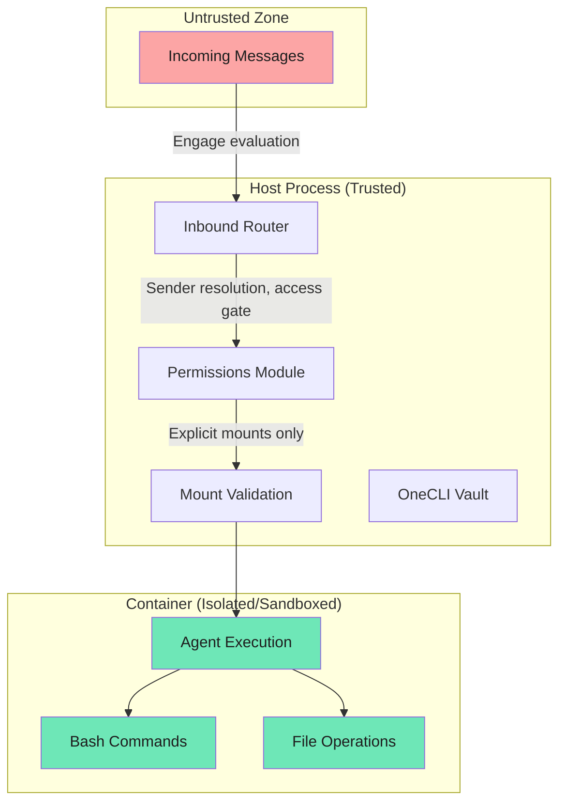

NanoClaw's security model is built on **true isolation** at the OS level rather than application-level permission checks. Agents run in actual Linux containers and can only access what's explicitly mounted. In v2, a new permissions system adds user roles, sender scope enforcement, and channel approval flows.

## Trust model

| Entity | Trust Level | Rationale |
|--------|-------------|-----------|
| Owner | Fully trusted | System administrator, all privileges |
| Admins | Trusted | Can approve senders and manage groups (global or scoped) |
| Known users | Permitted | Members of specific agent groups |
| Unknown senders | Untrusted | Policy-controlled per messaging group |
| Container agents | Sandboxed | Isolated execution environment |
| Incoming messages | User input | Potential prompt injection |

## Security boundaries

### 1. Container isolation (primary boundary)

Agents execute in containers (lightweight Linux VMs), providing:

- **Process isolation** — container processes cannot affect the host
- **Filesystem isolation** — only explicitly mounted directories are visible
- **Non-root execution** — runs as unprivileged `node` user (uid 1000)
- **Signal forwarding** — `tini` as PID 1 ensures clean shutdown

This is the primary security boundary. Rather than relying on application-level permission checks, the attack surface is limited by what's mounted.



<Note>
Bash access is safe because commands run inside the container, not on your host. The container's filesystem is isolated from the host.
</Note>

### 2. Mount security

#### External allowlist

Mount permissions stored at `~/.config/nanoclaw/mount-allowlist.json`, which is:

- Outside project root
- Never mounted into containers
- Cannot be modified by agents

**Default blocked patterns:**
```json
[
  ".ssh", ".gnupg", ".gpg", ".aws", ".azure", ".gcloud", ".kube", ".docker",
  "credentials", ".env", ".netrc", ".npmrc", ".pypirc", "id_rsa", "id_ed25519",
  "private_key", ".secret"
]
```

<Warning>
The mount allowlist is the security control that prevents agents from accessing sensitive directories. If no allowlist file exists, all additional mounts are blocked by default.
</Warning>

#### Protections

- **Symlink resolution** before validation (prevents traversal attacks)
- **Container path validation** (rejects `..` and absolute paths)
- **Container path colon rejection** (prevents Docker `-v` option injection)
- **RW gating** — read-write access requires both mount request AND allowed root to permit it; otherwise forced read-only

### 3. Permissions system

The v2 permissions module provides a three-level access control model:

#### User roles

| Role | Scope | Capabilities |
|------|-------|------------|
| Owner | Always global | All operations, approves channels and senders |
| Admin | Global or per-agent-group | Approves senders within scope |
| Member | Per-agent-group | Can interact with agents in their group |

#### Unknown sender policy

Each messaging group has an `unknown_sender_policy`:

| Policy | Behavior |
|--------|----------|
| `public` | Skip access check entirely — anyone can interact |
| `strict` | Unknown senders are silently dropped |
| `request_approval` | Unknown senders trigger an approval card to the admin |

#### Sender scope

Per-wiring enforcement via `sender_scope`:

- `all` — any user can trigger the agent through this wiring
- `known` — requires the user to be an owner, admin, or group member

#### Channel approval flow

When a message arrives on an unwired channel (no agent wirings exist):

1. The channel-request gate sends an approval card to the owner
2. **Approve** — creates a wiring with default settings, admits the triggering sender, replays the original event
3. **Deny** — sets `denied_at` on the messaging group; future mentions drop silently

#### Sender approval flow

When an unknown sender messages on a `request_approval` channel:

1. An approval card is sent to the designated approver (admin or owner)
2. **Approve** — adds sender to `agent_group_members`, replays the original message
3. **Deny** — deletes the pending row (future messages from this sender re-trigger)

### 4. Session isolation

Each session has isolated databases at `data/v2-sessions/{agent_group_id}/{session_id}/`:

- `inbound.db` and `outbound.db` per session
- Sessions cannot see other sessions' data
- Cross-session information disclosure is prevented by mount isolation

### 5. Credential handling

NanoClaw uses the [OneCLI](https://github.com/onecli/onecli) Agent Vault for centralized secret management. API keys are never stored in `.env` or exposed to containers — the vault intercepts outbound API traffic from containers and injects credentials at request time.

- Secrets are registered once via `onecli secrets create`
- Each non-main agent group gets its own OneCLI agent identifier for per-group credential scoping
- The `@onecli-sh/sdk` package's `applyContainerConfig()` configures container networking
- If the vault is unreachable, the container starts with no credentials and logs a warning

<Warning>
The OneCLI Agent Vault prevents credential exposure to containers. However, containers can still make authenticated API requests through the vault — they cannot extract the real credentials, but they can use them indirectly.
</Warning>

### 6. Delivery authorization

The delivery system enforces per-agent permissions:

- Source agent must be authorized to deliver to the target channel
- Messages to the origin chat (where the conversation started) are always permitted
- Cross-channel delivery requires an explicit `agent_destinations` row
- The `ask_question` message type creates interactive `pending_questions` cards

### 7. Diagnostics and telemetry

NanoClaw includes opt-in diagnostics that run during `/setup` and `/update-nanoclaw` skill workflows only. There is no runtime telemetry in the application itself.

<Info>
Diagnostics are entirely skill-driven — they exist as markdown instructions read by Claude, not as application code. No data is ever sent without explicit user approval.
</Info>

## Privilege comparison

| Capability | Owner | Admin | Member | Unknown |
|------------|-------|-------|--------|---------|
| All operations | ✓ | — | — | — |
| Approve senders | ✓ | Scoped | — | — |
| Interact with agents | ✓ | ✓ | ✓ | Policy-dependent |
| Cross-agent messaging | ✓ | ✓ | ✓ | — |

## Attack scenarios

### Prompt injection

**Attack**: user sends a malicious prompt to hijack agent behavior

**Mitigation**:
- Agent only has access to its own session's databases
- Cannot deliver to unauthorized channels (delivery authorization)
- Cannot access credential files (not mounted)
- Cannot modify mount allowlist (external, never mounted)

**Worst case**: agent sends its own session's messages to attacker (session is compromised, but other sessions remain isolated)

### Container escape attempt

**Attack**: agent tries to break out of container via kernel exploit

**Mitigation**:
- Container runtime provides kernel-level isolation
- Non-root execution limits attack surface
- `tini` as PID 1 ensures proper signal handling
- Host filesystem only accessible via explicit mounts

### Unknown sender exploitation

**Attack**: unknown user floods a public channel to exhaust resources

**Mitigation**:
- `strict` policy drops unknown senders silently
- `request_approval` requires admin action before processing
- Per-wiring `sender_scope=known` restricts to group members even on public channels

### Malicious attachment filename

**Attack**: a chat sender (or compromised peer agent) supplies an attachment whose filename contains path-traversal characters such as `../../etc/passwd`, hoping the host writes it outside the per-session inbox directory.

**Mitigation**:
- Every inbound attachment filename is validated before being joined to the inbox path
- Names containing `/`, `\`, NUL, `.`, or `..` are rejected and replaced with `attachment-<timestamp>`
- The check runs unconditionally on the channel-inbound path, including end-to-end-encrypted channels where filenames cannot be sanitized server-side
- See [attachment filename sanitization](/advanced/security-model#attachment-filename-sanitization) for details

## Best practices

1. **Use `request_approval` for public groups** — prevents unauthorized access while allowing legitimate users
2. **Review mount allowlist** — before allowing new mounts, verify they don't contain secrets
3. **Use `sender_scope=known` for sensitive wirings** — restricts to authorized users even on public channels
4. **Set up admin roles** — delegate sender approval without giving full owner access
5. **Monitor delivery logs** — check for unauthorized delivery attempts
6. **Update regularly** — security fixes may be released in upstream NanoClaw updates

## Related topics

- [Group isolation and per-group contexts](/concepts/groups)
- [Container isolation details](/concepts/containers)
- [System architecture](/concepts/architecture)
