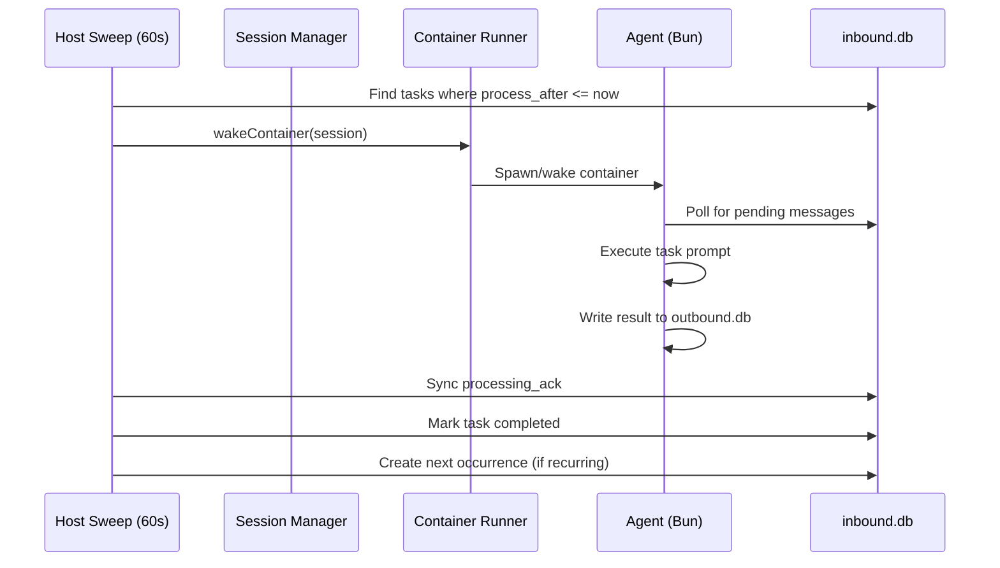
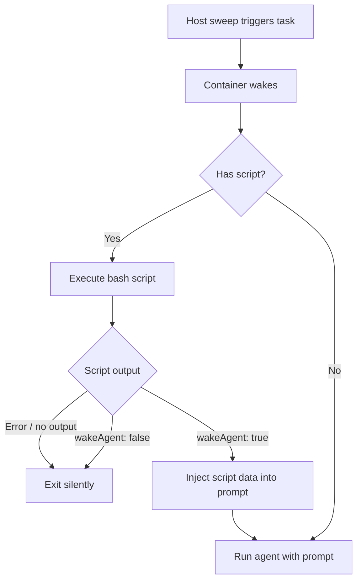

NanoClaw includes a built-in task scheduler that runs agents on a schedule. In v2, tasks are stored as `messages_in` rows with `kind='task'` — there is no separate task table. Tasks support cron-based recurrence with series tracking.

## What is a scheduled task?

A scheduled task is:

- A `messages_in` row with `kind='task'` and a `process_after` timestamp
- Executed in the context of a specific agent group session
- Has access to all agent tools (Bash, browser, MCP, etc.)
- Can send messages via the `send_message` MCP tool
- Supports recurring execution via cron expressions

<Info>
Tasks use the same message infrastructure as interactive messages. They are written to `inbound.db` and processed by the agent-runner's poll loop.
</Info>

## Schedule types

### Cron expressions (recurrence)

Tasks can have a `recurrence` field containing a cron expression:

```
┌───────────── minute (0 - 59)
│ ┌───────────── hour (0 - 23)
│ │ ┌───────────── day of month (1 - 31)
│ │ │ ┌───────────── month (1 - 12)
│ │ │ │ ┌───────────── day of week (0 - 6)
│ │ │ │ │
* * * * *
```

**Examples:**

- `0 9 * * *` — every day at 9:00 AM
- `0 */2 * * *` — every 2 hours
- `0 0 * * 1` — every Monday at midnight

**Timezone:**

Tasks use the configured timezone (resolved from `TZ` env, `.env`, or system default, validated as IANA). Cron expressions are evaluated in this timezone.

### One-time tasks

Tasks without a `recurrence` field run once when `process_after` is reached:

- After completion, the task row is marked `completed`
- No new rows are created

## Task lifecycle

### Creation

Tasks are created via the `schedule_task` MCP tool inside the container:

1. Agent calls `schedule_task` which writes a `kind='system'` outbound message with action fields
2. The delivery path routes this to `handleScheduleTask` on the host
3. Host creates a `kind='task'` row in `inbound.db` with `process_after` and optional `recurrence`
4. A `series_id` is set to the task's own ID (for tracking recurring instances)

### Execution



**Execution flow:**

1. Host sweep runs every 60 seconds and finds tasks where `process_after <= now`
2. Wakes the session's container (or spawns a new one)
3. Agent-runner's poll loop picks up the task as a pending message
4. Agent executes the task prompt
5. Host sweep syncs `processing_ack` from `outbound.db` to mark the task completed
6. For recurring tasks, a new row is created with the next `process_after`

<Info>
Tasks share the container concurrency pool with interactive messages. If all container slots are busy, tasks wait until a slot is available.
</Info>

### Recurring tasks

Recurring tasks use a series model:

- Each occurrence gets a new `messages_in` row sharing the same `series_id`
- When a recurring task completes, the host sweep calls `getCompletedRecurring()` to find it
- `insertRecurrence()` creates the next-run row with the updated `process_after`
- The `series_id` links all occurrences together

### Post-execution

After a task completes:

1. **Processing acknowledged** — host sweep syncs `processing_ack` from `outbound.db`
2. **Status updated** — task row marked `completed`
3. **Next occurrence** — for recurring tasks, a new pending row is created
4. **Container continues** — the container stays alive for other messages (no immediate shutdown)

## Task management operations

Tasks are managed via MCP tools available inside the container:

### schedule_task

Creates a new task. The agent writes a system message to `outbound.db`, and the host creates the task in `inbound.db`.

### cancel_task

Marks all live rows in the task's series as `completed` and nulls the recurrence. This stops the task permanently.

### pause_task

Toggles a pending task to `paused` status. Paused tasks are not picked up by the host sweep.

### resume_task

Toggles a paused task back to `pending` status. The task resumes on the next sweep cycle.

### update_task

Merges content updates in-place (prompt, script). Can also update `process_after` and `recurrence` independently. Matches by ID or `series_id` so recurring task updates hit the live next-occurrence row.

<Note>
`update_task` returns 0 when no live row matches, triggering a system notification back to the agent ("no live task matched").
</Note>

## Task scripts

For recurring tasks, you can add a `script` — a bash command that runs before the agent. If the script determines no action is needed, the agent is never invoked.

### How scripts work



1. The script runs first (30-second timeout)
2. It prints JSON to stdout: `{ "wakeAgent": true/false, "data": {...} }`
3. If `wakeAgent` is `false`, the task completes silently
4. If `wakeAgent` is `true`, the agent wakes with the script's data plus the prompt

### When NOT to use scripts

If a task requires agent judgment every time (daily briefings, reminders, reports), skip the script — just use a regular prompt.

## Task message format

Tasks are presented to the agent as XML, not as a `[SCHEDULED TASK]` plaintext header. Each `kind='task'` row renders as:

```xml
<task from="dest-name" time="2026-05-07T09:00:00-07:00">
Script output:
{ "wakeAgent": true, "data": { ... } }

Instructions:
Review open PRs
</task>
```

The `from` attribute identifies the originating destination so the agent can address its reply correctly. When the task's routing fields don't match a known destination, `from` falls back to `unknown:<channel_type>:<platform_id>`.

## Sending messages from tasks

Tasks can send messages by wrapping output in `<message to="dest-name">...</message>` blocks (the same explicit-addressing rule that applies to all agent output). Tasks can also use the `send_message` MCP tool for mid-execution acknowledgments. The delivery system routes both paths through the standard delivery pipeline with the same authorization checks as interactive messages.

**Silent tasks:**

If a task produces no `<message>` blocks and never calls `send_message`, it completes silently — the result is tracked via `processing_ack` but no message is sent to any channel. Bare text outside `<message>` blocks is scratchpad and is not delivered.

## Sequence numbers

All host-written messages (including tasks) use even-parity sequence numbers allocated via `nextEvenSeq()`. This ensures host writes and container writes never collide on sequence numbers.

## Error handling

Task errors don't stop the recurring schedule:

1. Task fails during execution
2. Processing acknowledged with error state
3. For recurring tasks, next occurrence is still created
4. No message sent to chat unless task explicitly sends before error

## Related topics

- [Group privileges and isolation](/concepts/groups)
- [Container execution and timeouts](/concepts/containers)
- [System architecture](/concepts/architecture)
- [Security model](/concepts/security)
