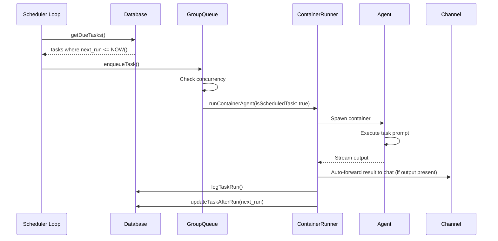

NanoClaw includes a built-in task scheduler that runs Claude agents on a schedule. Tasks have full agent capabilities and can optionally send results to group chats.

## What is a scheduled task?

A scheduled task is:

- A prompt that runs on a schedule (cron, interval, or one-time)
- Executed in the context of a specific group
- Has access to all agent tools (Bash, browser, MCP, etc.)
- Can send messages to the group chat or complete silently
- Tracked in the database with run history

<Info>
Tasks are essentially automated agent invocations. They run the same Claude Agent SDK as interactive messages, just triggered by time instead of user input.
</Info>

## Schedule types

Three schedule types are supported:

### Cron expressions

Standard cron syntax with timezone support:

```
┌───────────── minute (0 - 59)
│ ┌───────────── hour (0 - 23)
│ │ ┌───────────── day of month (1 - 31)
│ │ │ ┌───────────── month (1 - 12)
│ │ │ │ ┌───────────── day of week (0 - 6) (Sunday to Saturday)
│ │ │ │ │
* * * * *
```

**Examples:**

- `0 9 * * *` - Every day at 9:00 AM
- `0 */2 * * *` - Every 2 hours
- `0 0 * * 1` - Every Monday at midnight
- `30 14 1 * *` - 2:30 PM on the 1st of each month

**Timezone:**

- Defaults to system timezone (`process.env.TZ` or `Intl.DateTimeFormat().resolvedOptions().timeZone`)
- Configurable via `TZ` environment variable
- Uses `cron-parser` with timezone support

<Note>
Cron expressions are evaluated in the configured timezone, not UTC. This ensures tasks run at the expected local time even across daylight saving changes.
</Note>

### Interval

Repeat every N milliseconds:

- `3600000` - Every hour (3600 * 1000 ms)
- `86400000` - Every day (24 * 60 * 60 * 1000 ms)
- `60000` - Every minute

**Next run calculation:**

```typescript
// Anchor to the scheduled time, not now, to prevent drift.
// Skip past any missed intervals so we always land in the future.
let next = new Date(task.next_run).getTime() + ms;
while (next <= now) {
  next += ms;
}
const nextRun = new Date(next).toISOString();
```

Intervals are anchored to the **scheduled time** of the previous run, not the current time. This prevents cumulative drift. If intervals are missed (e.g., system was down), they are skipped to the next future occurrence.

### One-time

Run once at a specific ISO 8601 timestamp:

- `2026-03-01T14:30:00Z` - March 1st, 2026 at 2:30 PM UTC
- `2026-02-28T09:00:00-08:00` - Feb 28th, 2026 at 9 AM Pacific

**After execution:**

- `next_run` set to `null`
- Task status set to `completed`
- Will not run again unless `next_run` is manually updated and status reset to `active`

## Task lifecycle

### Creation

1. Agent calls `schedule_task` MCP tool (or user creates via IPC)
2. Task inserted into database with status `active`
3. `next_run` calculated based on schedule type
4. Task becomes eligible for execution when `next_run <= NOW()`

### Execution



**Execution flow:**

1. Scheduler polls database every 60 seconds (`SCHEDULER_POLL_INTERVAL`)
2. Finds tasks where `next_run <= NOW()` and `status = 'active'`
3. Re-checks status (in case task was paused between poll and execution)
4. Enqueues task in GroupQueue
5. GroupQueue respects concurrency limits (tasks and messages share the pool)
6. Container spawned with `isScheduledTask: true` flag
7. Agent executes task prompt
8. Results automatically forwarded to the group chat when the agent produces output
9. Run logged to `task_run_logs` table with duration and result
10. `next_run` recalculated based on schedule type
11. Container closes after 10-second grace period

<Info>
Tasks respect the same concurrency limits as interactive messages. If all 5 container slots are busy, tasks wait in queue.
</Info>

### Post-execution

After a task completes:

1. **Run logged**: Duration, result summary, error (if any) written to `task_run_logs` table
2. **Next run calculated**: 
   - Cron: Next matching time according to cron expression
   - Interval: Scheduled time + interval milliseconds (anchored to prevent drift)
   - Once: Set to `null`
3. **Last result updated**: First 200 chars of result stored in `tasks.last_result`
4. **Container closes**: 10-second grace period, then stdin closed (container exits)

### Completion

Task containers close automatically after producing output:

```typescript
const TASK_CLOSE_DELAY_MS = 10000; // 10 seconds

// After task produces result:
setTimeout(() => {
  queue.closeStdin(chatJid); // Signal container to exit
}, TASK_CLOSE_DELAY_MS);
```

**Why 10 seconds?**

- Tasks are single-turn (no follow-up messages)
- Grace period allows final MCP calls to complete
- Much faster than idle timeout (30 minutes for interactive sessions)
- Prevents resource waste from long-lived task containers

## Task context modes

Tasks can run in two context modes:

### Isolated context (default)

- Fresh Claude session for each run
- No conversation history from previous runs
- No conversation history from group chat
- Stateless execution (each run is independent)

**Use cases:**

- Status checks that don't need history
- Periodic data fetching
- Health monitoring
- Any task that should start fresh each time

### Group context

- Uses the group's current Claude session
- Has access to conversation history
- Sees previous task runs in same group context
- Can reference files and context from interactive messages

**Use cases:**

- Reminders that need conversation context
- Tasks that build on previous interactions
- Context-aware notifications
- Any task that should feel like part of the conversation

**Database field:**

```typescript
interface ScheduledTask {
  context_mode: 'isolated' | 'group';
  // ... other fields
}
```

<Note>
Group context tasks share the session with interactive messages. This means the task's actions (files read, tools used) become part of the group's conversation history.
</Note>

## Task management operations

Tasks are managed via MCP tools (available in `container/skills/nanoclaw.md`):

### schedule_task

Create a new task:

```typescript
await claudeCode.tools.schedule_task({
  prompt: "Check if example.com is up and notify if down",
  schedule_type: "interval",
  schedule_value: "300000", // 5 minutes
  context_mode: "isolated"
});
```

### list_tasks

View tasks (filtered by group):

```typescript
const tasks = await claudeCode.tools.list_tasks();
// Main group: sees all tasks
// Non-main groups: only see own tasks
```

Task snapshots are refreshed immediately after any IPC task mutation (`schedule_task`, `pause_task`, `resume_task`, `cancel_task`, `update_task`), so `list_tasks` always reflects the latest state — even within the same agent session that made the change.

### pause_task

Temporarily disable a task:

```typescript
await claudeCode.tools.pause_task({ task_id: "abc123" });
// Sets status to 'paused', task won't run until resumed
```

### resume_task

Re-enable a paused task:

```typescript
await claudeCode.tools.resume_task({ task_id: "abc123" });
// Sets status to 'active', task runs on next schedule
```

### update_task

Modify an existing task's prompt or schedule:

```typescript
await claudeCode.tools.update_task({
  task_id: "abc123",
  prompt: "Updated prompt text",
  schedule_type: "interval",
  schedule_value: "7200000"
});
// Only include the fields you want to change
// next_run is automatically recalculated if schedule changes
```

### cancel_task

Permanently delete a task:

```typescript
await claudeCode.tools.cancel_task({ task_id: "abc123" });
// Deletes from database, including all run history
```

<Warning>
Canceling a task deletes all run history. Pause the task instead if you want to preserve logs.
</Warning>

## Sending messages from tasks

Tasks can send messages to their group chat using the `send_message` tool:

```typescript
// Inside task prompt:
await claudeCode.tools.send_message({
  text: "Website is down! Last checked: " + new Date().toISOString()
});
```

**Authorization:**

- Tasks can only send to their own group's chat
- Same IPC authorization as interactive messages
- Main group tasks can send to any chat
- Non-main group tasks limited to own chat

**Silent tasks:**

If a task doesn't call `send_message`, it completes silently:

- Result logged to database
- No message sent to chat
- Useful for background data collection or status checks

<Info>
Task results are always logged to the database, whether or not they send a message. Check `task_run_logs` table for execution history.
</Info>

## Task run history

All task executions are logged to `task_run_logs` table:

```typescript
interface TaskRunLog {
  task_id: string;       // Foreign key to scheduled_tasks
  run_at: string;        // ISO timestamp of execution
  duration_ms: number;   // Execution time in milliseconds
  status: 'success' | 'error';
  result: string | null; // Agent output
  error: string | null;  // Error message if failed
}
```

The `id` column is an auto-incrementing integer primary key in the database.

**Querying history:**

```sql
-- Last 10 runs for a task
SELECT * FROM task_run_logs 
WHERE task_id = 'abc123' 
ORDER BY run_at DESC 
LIMIT 10;

-- Failed runs in the last 24 hours
SELECT * FROM task_run_logs 
WHERE status = 'error' 
AND run_at > datetime('now', '-1 day')
ORDER BY run_at DESC;
```

## Group privileges for tasks

| Operation | Main Group | Non-Main Group |
|-----------|------------|----------------|
| Schedule task for self | ✓ | ✓ |
| Schedule task for others | ✓ | ✗ |
| View all tasks | ✓ | Own only |
| Pause/resume own tasks | ✓ | ✓ |
| Pause/resume others' tasks | ✓ | ✗ |
| Cancel own tasks | ✓ | ✓ |
| Cancel others' tasks | ✓ | ✗ |
| Send message to own chat | ✓ | ✓ |
| Send message to other chats | ✓ | ✗ |

<Note>
Task privileges match the group's general privilege model. Main group can manage all tasks, non-main groups can only manage their own.
</Note>

## Task scheduling best practices

1. **Use cron for wall-clock times**: "Every day at 9 AM" should be cron, not interval
2. **Use interval for frequency-based**: "Every 5 minutes" should be interval, not cron
3. **Start with isolated context**: Add group context only if needed
4. **Include error handling**: Tasks should handle failures gracefully
5. **Use descriptive prompts**: "Check website uptime" not "check status"
6. **Monitor task_run_logs**: Failed tasks may indicate issues
7. **Avoid very short intervals**: Respect container startup overhead (minimum ~5s)
8. **Clean up completed one-time tasks**: Cancel or pause them to reduce clutter

## Common patterns

### Daily summary task

```typescript
await claudeCode.tools.schedule_task({
  prompt: "Read today's messages and send a summary of important topics",
  schedule_type: "cron",
  schedule_value: "0 18 * * *", // 6 PM daily
  context_mode: "group"
});
```

### Health monitoring

```typescript
await claudeCode.tools.schedule_task({
  prompt: "Check if https://example.com returns 200 OK. If not, send alert.",
  schedule_type: "interval",
  schedule_value: "300000", // Every 5 minutes
  context_mode: "isolated"
});
```

### One-time reminder

```typescript
await claudeCode.tools.schedule_task({
  prompt: "Remind me about the team meeting tomorrow",
  schedule_type: "once",
  schedule_value: "2026-03-01T09:00:00-08:00",
  context_mode: "group"
});
```

### Background data collection

```typescript
await claudeCode.tools.schedule_task({
  prompt: "Fetch latest crypto prices and store in prices.json (no message)",
  schedule_type: "interval",
  schedule_value: "60000", // Every minute
  context_mode: "isolated"
});
```

## Error handling

Task errors are logged but don't stop the schedule:

1. Task fails during execution
2. Error logged to `task_run_logs` with `status: 'error'`
3. `last_result` updated with error summary
4. `next_run` still calculated (task will retry on next schedule)
5. No message sent to chat (unless task explicitly sends before error)

**Persistent failures:**

If a task fails repeatedly:

- Check `task_run_logs` for error messages
- Review container logs at `groups/{folder}/logs/`
- Pause the task to stop the retry loop
- Fix the underlying issue (permissions, network, etc.)
- Resume the task

<Warning>
Tasks with invalid group folders are automatically paused to prevent retry churn.
</Warning>

## Related topics

- [Group privileges and isolation](/concepts/groups)
- [Container execution and timeouts](/concepts/containers)
- [System architecture](/concepts/architecture)
- [Security model](/concepts/security)
