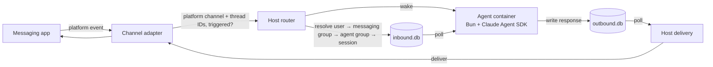

NanoClaw v2 is a single Node host process that orchestrates per-session agent containers. Messages route through an explicit entity model and the host and container exchange data only through two SQLite files per session. There is no IPC, no file watcher, and no stdin piping between them — everything is a message.

<Info>
**Source status** — Verified against [`qwibitai/nanoclaw`](https://github.com/qwibitai/nanoclaw) at tag `v2.0.54` (commit `a33b1ae`), package version `2.0.54`, on 2026-05-10. Primary sources checked: `README.md`, `CLAUDE.md`, `docs/architecture.md`, `docs/isolation-model.md`, `docs/build-and-runtime.md`, `docs/db-central.md`, `src/db/schema.ts`, `src/router.ts`, `src/container-config.ts`, `src/cli/`.
</Info>

## Message flow

```text
messaging apps → host process (router) → inbound.db → container (Bun, Claude Agent SDK) → outbound.db → host process (delivery) → messaging apps
```



1. A channel adapter receives a platform event, decides whether it's triggered, and reports the platform channel ID, optional thread ID, and trigger result. The adapter never sees agent group IDs or session IDs.
2. The host router resolves that to a session through the entity model and writes the message into the session's `inbound.db`, then wakes the container.
3. The agent-runner inside the container polls `inbound.db`, runs Claude, and writes responses to `outbound.db`.
4. The host's delivery loop polls `outbound.db`, looks up where the response goes, and sends it back through the channel adapter. A 60-second host sweep handles stale-session detection, due-task wakeups, and recurrence.

## The entity model

v2 separates messaging surfaces from agent identities and wires them together explicitly:

```text
users (id "<channel_type>:<handle>", kind, display_name)
  └─ user_roles (user_id, role ∈ {owner, admin}, agent_group_id nullable)   — owner is global; admin is global or scoped
  └─ agent_group_members (user_id, agent_group_id)                            — "known" membership gate

agent_groups (workspace, memory, CLAUDE.md, personality)
container_configs (provider, model, effort, packages, MCP servers, mounts, skills, cli_scope)
   ↕ many-to-many via messaging_group_agents
       (engage_mode, engage_pattern, sender_scope, ignored_message_policy, session_mode, priority)
messaging_groups (one chat/channel on one platform; channel_type, platform_id, unknown_sender_policy)

sessions (agent_group_id + messaging_group_id + thread_id → per-session container)
```

Key consequences:

- **One agent can answer on many chats, and one chat can fan out to many agents.** v1 could do neither — it had one flat `registered_groups` table where a chat mapped to exactly one folder.
- **Privilege is user-level, not channel-level.** Roles live in `user_roles` (owner is always global; admin can be global or scoped to an agent group). The old "main channel = admin" concept is gone. The router-side admin command gate queries `user_roles` directly — there is no environment variable for admin user IDs.
- **Engagement is decomposed into orthogonal columns** on the `messaging_group_agents` wiring, replacing v1's opaque `trigger_pattern` regex:
  - `engage_mode` — `mention` (default), `pattern`, or `mention-sticky`
  - `engage_pattern` — regex source, required when `engage_mode='pattern'`; `'.'` means "match every message"
  - `sender_scope` — `all` (default) or `known`
  - `ignored_message_policy` — `drop` (default) or `accumulate`
  - `session_mode` and `priority`
- **Unknown senders** are governed per messaging group by `unknown_sender_policy` (`strict`, `request_approval`, or `public`).

## Agent groups, sessions, and containers

An **agent group** has its own filesystem under `groups/<folder>/` — `CLAUDE.md`, skills, memory, and workspace files. Its runtime config lives in the central DB's `container_configs` table: provider, model, effort, packages, MCP servers, mounts, skills, and `cli_scope`. A materialized `container.json` is written at spawn time for the container runner. A **session** is keyed by `(agent_group_id, messaging_group_id, thread_id)` and gets its own container with that agent group's filesystem mounted and its own pair of session DBs. Multiple sessions can share one agent group (same skills, same memory) while keeping separate conversation contexts.

The agent's `CLAUDE.md` is composed at container spawn from a shared base (`.claude-shared.md`, a symlink to the global file), module fragments (`.claude-fragments/*.md`), and per-group `CLAUDE.local.md`. Don't edit the composed `CLAUDE.md` directly.

## Channel isolation — three levels

When you connect a channel, you choose how it relates to your existing agents (see [`docs/isolation-model.md`](https://github.com/qwibitai/nanoclaw/blob/main/docs/isolation-model.md)):

| Level | What's shared | Wiring |
|-------|---------------|--------|
| Separate agent groups | Nothing — different `CLAUDE.md`, memory, workspace, container, conversation | Each messaging group → a different agent group |
| Same agent, separate sessions | Workspace, memory, `CLAUDE.md`, personality; conversations stay independent | Multiple messaging groups → one agent group, `session_mode: 'shared'` |
| Shared session | Everything, including the conversation itself — all channels appear in one thread | Multiple messaging groups → one agent group, `session_mode: 'agent-shared'` |

The decision question: are you okay with any piece of information from one channel being available in the other? If no, use separate agent groups. If yes and the channels should see each other's messages, use a shared session. If yes but the conversations should stay independent, use the same agent with separate sessions.

## Channels and providers are skill-installed

Trunk ships the registry and infrastructure, not specific channel adapters or non-default agent providers:

- **`channels` branch** — Discord, Slack, Telegram, WhatsApp, Teams, Linear, GitHub, iMessage, Webex, Resend, Matrix, Google Chat, WhatsApp Cloud, plus their setup steps. Installed via `/add-<channel>` skills.
- **`providers` branch** — OpenCode and other non-default agent providers. Installed via `/add-opencode` (and `/add-codex`, `/add-ollama-provider`).

Each `/add-<name>` skill is idempotent: fetch the branch, copy the module(s) into the standard paths, append a self-registration import, install pinned dependencies, and build. Credentials are managed by OneCLI's Agent Vault — secrets are injected into per-agent containers at request time and never passed via env vars or chat context.

The `ncl` admin CLI manages live state in the central DB. In v2.0.54, per-group runtime settings are updated with commands such as `ncl groups config update --model <model> --effort <level>` and applied on an explicit `ncl groups restart`.

## Runtime split: Node host, Bun container

The host runs on **Node 22 + pnpm**; the agent container runs on **Bun**. They share no modules — the only interface is the two session DBs — which is what lets them use different runtimes cleanly.

- **Host stays on Node** because some channel adapters (notably WhatsApp's Baileys) depend on native bindings and a long-tested HTTP/WebSocket stack.
- **Container runs Bun** because `bun:sqlite` is built in (no per-image native compile of `better-sqlite3`), source runs directly (no `tsc` build step at image build or session wake), and `bun install` is much faster.
- **Lockfiles:** the host uses `pnpm-lock.yaml` with a `minimumReleaseAge` supply-chain policy; the agent-runner uses `container/agent-runner/bun.lock`. Both are committed; CI and the Dockerfile run `--frozen-lockfile`.
- **Tests:** host tests run under vitest (`pnpm test`); agent-runner tests run under `bun:test` (`cd container/agent-runner && bun test`).

## Key source files

| File | Purpose |
|------|---------|
| `src/index.ts` | Entry point: DB init, migrations, channel adapters, delivery polls, sweep, shutdown |
| `src/router.ts` | Inbound routing: messaging group → agent group → session → `inbound.db` → wake |
| `src/delivery.ts` | Polls `outbound.db`, delivers via adapter, handles system actions |
| `src/host-sweep.ts` | 60-second sweep: `processing_ack` sync, stale detection, due-message wake, recurrence |
| `src/session-manager.ts` | Resolves sessions; opens `inbound.db` / `outbound.db`; manages the heartbeat path |
| `src/container-config.ts` | Reads/writes per-group runtime config from `container_configs`; materializes `container.json` at spawn time |
| `src/container-runner.ts` | Spawns per-agent-group containers, OneCLI credential injection |
| `src/cli/` | `ncl` admin CLI for DB-backed groups, wirings, approvals, sessions, destinations, and config |
| `src/db/` | Central DB layer — agent groups, messaging groups, sessions, user roles, migrations |
| `src/channels/` | Channel adapter infra; specific adapters are skill-installed from the `channels` branch |
| `src/providers/` | Host-side provider config (`claude` baked in; others via the `providers` branch) |
| `container/agent-runner/` | Bun agent-runner: poll loop, MCP tools, provider abstraction |
| `groups/<folder>/` | Per-agent-group filesystem (`CLAUDE.md`, skills, memory/workspace files); runtime config is DB-backed |

For the full architecture writeup, see [`docs/architecture.md`](https://github.com/qwibitai/nanoclaw/blob/main/docs/architecture.md) in the source repo.

## Related

<Columns cols={2}>
  <Card title="Database and sessions" icon="database" href="/database-and-sessions">
    The three-DB model, the two-DB session split, and cross-mount rules.
  </Card>
  <Card title="Migrating from v1" icon="arrow-up-right" href="/migration-from-v1">
    Where v1 concepts moved in the v2 entity model.
  </Card>
</Columns>
