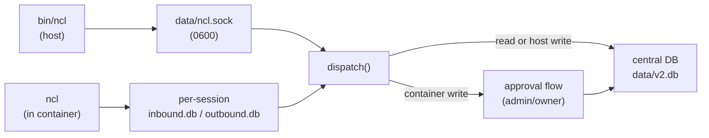

## Overview

`ncl` is the NanoClaw admin CLI. It queries and modifies the central configuration — agent groups, messaging groups, wirings, users, roles, members, destinations, and more — from the terminal or from inside an agent container.

Two transports, one interface:

- **On the host** — connects to a Unix socket at `data/ncl.sock` (chmod `0600`, owned by the user that started the host).
- **Inside a container** — uses the per-session database transport, with admin approval gating for write commands.

`ncl` is not the same as [`claw`](/features/cli). `claw` sends prompts to an agent; `ncl` manages the configuration that backs every agent.

## Installation

`ncl` is installed automatically by `/setup` — the script symlinks `bin/ncl` into `~/.local/bin/ncl`. Verify with:

```bash
ncl help
```

If `~/.local/bin` is not on your `PATH`, add it to your shell profile. Or invoke `bin/ncl` directly from your NanoClaw checkout.

Inside agent containers, `ncl` is available as `/usr/local/bin/ncl` and is on the agent's `PATH` by default.

## Usage

```
ncl <resource> <verb> [<id>] [--flags]
ncl <resource> help
ncl help
```

- Flags use `--hyphen-case` (e.g. `--agent-group-id`) and map to `underscore_case` DB columns automatically.
- `list` supports filtering by any non-auto column (e.g. `ncl wirings list --messaging-group-id mg_xyz`). Default limit is 200 rows; override with `--limit N`.
- Add `--json` to any command for machine-readable output.
- For composite-key resources (`roles`, `members`, `destinations`), use the custom verbs (`grant`/`revoke`, `add`/`remove`) instead of `create`/`delete`.

## Resources

| Resource | Verbs | What it is |
|----------|-------|------------|
| `groups` | `list`, `get`, `create`, `update`, `delete` | Agent groups (workspace, personality, container config) |
| `messaging-groups` | `list`, `get`, `create`, `update`, `delete` | A single chat or channel on one platform |
| `wirings` | `list`, `get`, `create`, `update`, `delete` | Links a messaging group to an agent group (session mode, triggers) |
| `users` | `list`, `get`, `create`, `update` | Platform identities (`<channel>:<handle>`) |
| `roles` | `list`, `grant`, `revoke` | Owner and admin privileges (global or scoped to an agent group) |
| `members` | `list`, `add`, `remove` | Unprivileged access gate for an agent group |
| `destinations` | `list`, `add`, `remove` | Where an agent group is allowed to send messages |
| `sessions` | `list`, `get` | Active sessions (read-only) |
| `user-dms` | `list` | Cold-DM cache (read-only) |
| `dropped-messages` | `list` | Messages from unregistered senders (read-only) |
| `approvals` | `list`, `get` | Pending approval requests (read-only) |

Run `ncl <resource> help` to see fields, types, enums, and which fields are required or updatable.

## Examples

### Inspect configuration

```bash
# List every agent group
ncl groups list

# Look up a specific group
ncl groups get abc123

# See which messaging groups route to a given agent group
ncl wirings list --agent-group-id abc123

# See who has admin or owner privileges
ncl roles list
```

### Create and modify

```bash
# Create a new agent group
ncl groups create --name "Research" --folder research

# Rename it
ncl groups update abc123 --name "Research v2"

# Wire a messaging group to an agent group
ncl wirings create --messaging-group-id mg_xyz --agent-group-id abc123 --session-mode shared

# Grant a global admin role
ncl roles grant --user telegram:jane --role admin

# Grant an admin role scoped to one agent group
ncl roles grant --user discord:bob --role admin --group abc123

# Add a member to an agent group
ncl members add --user-id telegram:jane --agent-group-id abc123

# Allow an agent group to send to a messaging group
ncl destinations add --agent-group-id abc123 --messaging-group-id mg_xyz
```

### JSON output for scripting

```bash
ncl wirings list --json | jq '.[] | select(.session_mode == "per-thread")'
```

## Access model

Read commands (`list`, `get`) run inline regardless of caller.

Write commands (`create`, `update`, `delete`, `grant`, `revoke`, `add`, `remove`) behave differently depending on where they are invoked:

<Tabs>
  <Tab title="Host">
    Connecting to `data/ncl.sock` requires file-system access to a `0600` socket owned by the host user. The socket itself is the auth boundary — host callers run write commands inline, with no approval step.
  </Tab>

  <Tab title="Container (agent)">
    When an agent runs `ncl` inside its container, write commands return `approval-pending` immediately and are held until an owner or admin approves. The flow:

    1. Agent runs the command (e.g. `ncl groups create --name "Research" --folder research`).
    2. The CLI returns immediately with `approval-pending` — the command has **not** executed yet.
    3. An admin or owner receives a notification (delivered on the same channel when possible) showing the exact `ncl` command, with approve/reject options.
    4. After the admin responds:
       - **Approved** — the command executes and the result is delivered back to the agent as a system message in the same conversation.
       - **Rejected** — the agent receives a system message saying the request was rejected.

    Approvers are resolved from the `user_roles` table — preference order: scoped admins for the agent group → global admins → owners.
  </Tab>
</Tabs>

## How it works



Both transports build the same request frame and call the same dispatcher. The dispatcher checks the caller and the command's access mode, gates risky calls behind admin approval when the caller is an agent, runs the resource handler, and returns a structured response frame.

## Inside containers

Container-side `ncl` writes a `cli_request` system message into the session's `outbound.db` and polls `inbound.db` for the response — no extra IPC, no shared socket. The host dispatches the request, runs the handler (or routes through the approval flow), and writes the response back to `inbound.db` for the agent to pick up.

This is the same two-DB transport that carries every other host ↔ container message. See [IPC system](/advanced/ipc-system) for the underlying mechanism.

## Troubleshooting

<AccordionGroup>
  <Accordion title="'ncl: command not found'">
    `/setup` symlinks `bin/ncl` into `~/.local/bin/ncl`. If that directory is not on your `PATH`, either add it or invoke `bin/ncl` directly from your NanoClaw checkout. The symlink installer is idempotent — it overwrites an existing symlink but won't clobber a real file.
  </Accordion>

  <Accordion title="'connect ENOENT data/ncl.sock'">
    The host process is not running, or it crashed before binding the socket. Start the host (`pnpm run dev` or restart the service) and try again. The socket is recreated on each startup — stale files from a crashed run are cleaned up automatically.
  </Accordion>

  <Accordion title="Container `ncl` returns 'approval-pending' and never resolves">
    A write command is waiting for an admin or owner to approve it. Check `ncl approvals list` on the host to see pending requests, and confirm at least one user has `owner` or `admin` in `user_roles`. Run `ncl roles list` to verify.
  </Accordion>

  <Accordion title="'unknown-command'">
    The command barrel is loaded at host startup. If you've just added a new resource definition under `src/cli/resources/`, restart the host so the registry picks it up.
  </Accordion>
</AccordionGroup>

## Next steps

<CardGroup cols={2}>
  <Card title="Group management" icon="layer-group" href="/api/group-management">
    The entity model `ncl` reads and writes — agent groups, messaging groups, wirings
  </Card>

  <Card title="Sending prompts (claw)" icon="terminal" href="/features/cli">
    Send a one-off prompt to an agent from the terminal
  </Card>
</CardGroup>
