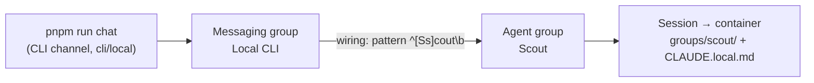

{/* verified-against: src/cli/resources/{groups,wirings,messaging-groups,sessions}.ts, src/cli/crud.ts, src/router.ts, src/channels/cli.ts, scripts/chat.ts, scripts/init-cli-agent.ts, src/group-init.ts, src/container-runner.ts, setup/auto.ts @ dc34ceb (v2.1.4) */}

If you followed the [quickstart](/quickstart), the setup wizard already built your first agent. This tutorial builds a **second** one by hand, so you see every part the wizard hides: an **agent group** (the identity), a **messaging group** (the chat), and a **wiring** (the routing rule connecting them). We'll use the [CLI channel](/channels/cli) — it ships on trunk and needs zero platform credentials.

You need a working install with the host service running, [`ncl`](/operate/ncl-cli) on your PATH (or `pnpm ncl` from the checkout), and Docker up.

<Steps>
<Step title="Create the agent group">

An agent group is just a row in the central DB plus a folder under `groups/` — but the folder doesn't exist yet, as you'll see.

```bash
ncl groups create --name "Scout" --folder scout
```

`ncl` prints the inserted row, including the generated UUID. Save it — every later command takes `--id`:

```json
{
  "id": "3f2c9a1e-8b4d-4f6a-9c2e-d51b7a0e6f33",
  "name": "Scout",
  "folder": "scout",
  "created_at": "2026-06-10T09:14:02.511Z"
}
```

Now check the filesystem: `ls groups/` — there is **no `scout/` folder**. Creation only writes the DB row. The folder (and the container config, session state, and skills directory) is initialized lazily by `initGroupFilesystem()` the first time a container spawns for this group. An agent that has never been messaged costs nothing.

</Step>
<Step title="Find the CLI messaging group">

A messaging group is one chat on one platform, identified by a unique (`channel_type`, `platform_id`) pair. The CLI channel hardcodes its platform ID to `local`, and setup leaves the "Local CLI" messaging group in place, so it should already exist:

```bash
ncl messaging-groups list --channel-type cli
```

Note the `id` of the row with `platform_id` = `local`. If the list is empty (CLI-less install), create it exactly as the setup script does — `unknown_sender_policy` must be `public` because the terminal's synthetic `cli:local` user holds no role:

```bash
ncl messaging-groups create --channel-type cli --platform-id local \
  --name "Local CLI" --unknown-sender-policy public
```

</Step>
<Step title="Wire them together">

A wiring tells the router which agent handles messages from which chat, and when it engages:

```bash
ncl wirings create --messaging-group-id <mg-id> --agent-group-id <agent-id> \
  --engage-mode pattern --engage-pattern '^[Ss]cout\b'
```

Two things matter here:

- **`--engage-mode pattern` is required on CLI.** The default mode, `mention`, relies on platform-level @-mentions, which the CLI channel never produces — a `mention` wiring on CLI simply never fires.
- **The pattern is a JavaScript regex** tested against the message text. `^[Ss]cout\b` engages Scout only when a message starts with its name. Don't use inline flags like `(?i)` — JS regexes reject them, and an invalid pattern fails *open* (the agent responds to everything).

<Warning>
Routing is fan-out: every wiring on a chat is evaluated independently. Your setup-created agent is wired to this same chat with pattern `.` (match everything), so a message starting with "scout" engages **both** agents and you'll get two replies. To give Scout exclusive ownership of its name, find the original wiring with `ncl wirings list` and narrow it: `ncl wirings update --id <original-wiring-id> --engage-pattern '^(?![Ss]cout\b)'`.
</Warning>

</Step>
<Step title="Talk to it">

```bash
pnpm run chat scout hi, who are you and what can you do
```

The message hits `data/cli.sock`, the router matches your pattern, creates a session, and spawns a container. First contact is a cold start — expect **30–60 seconds** before the reply prints. Follow-ups to a warm container are much faster, and the session persists server-side, so context carries across invocations.

If nothing comes back after the cold start, check what the router did with the message:

```bash
ncl dropped-messages list
```

A `no_agent_engaged` drop row only appears when no wiring on the chat matched at all — in this tutorial's setup a catch-all (or complementary) pattern always engages one agent, so if the table is empty, check whether the *other* agent answered instead: your message probably didn't start with "scout".

</Step>
<Step title="Inspect what was created">

That first message materialized everything that was lazy in step 1. The group folder now exists:

```bash
ls groups/scout/
# CLAUDE.md  CLAUDE.local.md
```

`CLAUDE.md` is the composed instructions file the host regenerates on every spawn — don't edit it. `CLAUDE.local.md` is the agent's editable persistent memory, auto-loaded on every spawn. Groups created via `ncl` start with it **empty** — edit it to give Scout a personality and standing instructions (see [customize an agent](/guides/customize-an-agent)).

The session — the runtime unit mapping this (agent, chat) pair to a container — is visible too:

```bash
ncl sessions list --agent-group-id <agent-id>
```

Look for `status` = `active` and `container_status` = `running`. And the container itself, named `nanoclaw-v2-<folder>-<timestamp>`:

```bash
docker ps --filter name=nanoclaw-v2-scout
```

It stays warm for a while after the conversation, then exits; the host respawns it on the next message. To force a fresh one (with an image rebuild, e.g. after adding packages):

```bash
ncl groups restart --id <agent-id> --rebuild
```

</Step>
</Steps>

## What you built



One agent identity, one chat, one routing rule between them — and a session/container pair that only exists because you sent a message. Every channel in NanoClaw works through these same four pieces; only the adapter changes. See the [entity model](/concepts/entity-model) for the full picture.

## Next steps

- [Customize an agent](/guides/customize-an-agent) — memory, container config, models, packages
- [Multi-agent swarm](/guides/multi-agent-swarm) — wire several agents that talk to each other
- [Channels overview](/channels/overview) — wire Scout to WhatsApp, Telegram, Discord, and more
