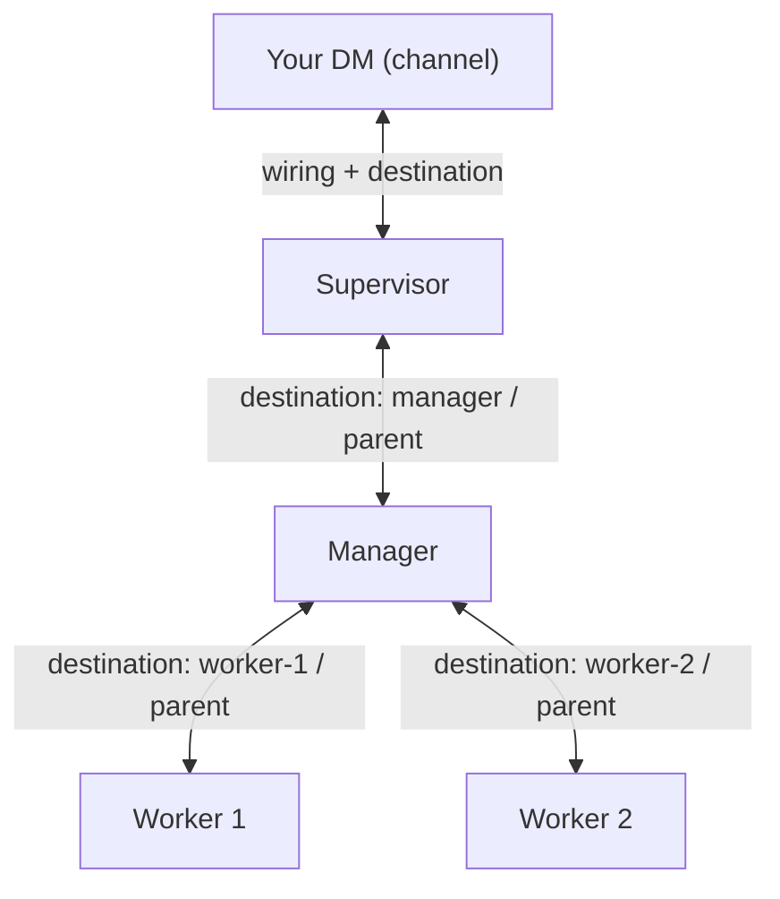

{/* verified-against: src/modules/agent-to-agent/{create-agent,agent-route,write-destinations,index}.ts, src/modules/agent-to-agent/db/agent-destinations.ts, src/modules/approvals/primitive.ts, container/agent-runner/src/mcp-tools/agents.ts + agents.instructions.md, container/agent-runner/src/destinations.ts, src/cli/resources/{destinations,groups,wirings}.ts, src/group-init.ts, src/db/messaging-groups.ts @ e3986eb (v2.1.16) */}

The [introduction](/introduction) promises real teams: a worker per task, a manager that tracks what's in flight, a supervisor that pings you. This tutorial builds the smallest working version — one agent spawning and delegating to another — then scales the same three primitives into that trio. It continues from [your first agent](/guides/first-agent); you'll reuse Scout to see the approval gate.

## The model in 60 seconds

There is no swarm engine. Multi-agent in NanoClaw is the same three things everything else is:

- **Agent groups are fully isolated.** Each agent has its own container, workspace, and memory. Agents never share state — they can only message each other.
- **Agent-to-agent messages are queue rows.** A message to another agent travels through the same SQLite inbox/outbox pipeline as a WhatsApp message; only `channel_type` differs (`agent` instead of a platform).
- **Destinations are the permission edges.** A row in `agent_destinations` means "agent A may send to target B, and calls it `local-name`". No row, no delivery — the host rejects unauthorized sends. Channels and agents share one namespace, so messaging an agent is just `send_message` with `to` set to its name.



Every arrow is one or two `agent_destinations` rows. Each direction is a separate row — A having an edge to B does not give B an edge back.

<Steps>
<Step title="Ask your agent to create a helper">

Message the agent the setup wizard created (the one in your main chat):

```text
Create an agent called researcher. Its job: take a research question from you,
dig in with web search, and report findings back to you with sources.
```

The agent calls the `create_agent` MCP tool with a `name` and that role as `instructions`. The call is fire-and-forget — it returns immediately, and the host does the privileged work:

1. Inserts an `agent_groups` row. The folder is the normalized name (`researcher`), with a numeric suffix if taken.
2. Scaffolds `groups/researcher/` and seeds the **`instructions` text into the new agent's memory** — `CLAUDE.local.md` for the Claude default, or the `memory/` scaffold's landing file on a provider that owns its memory. That's the agent's persistent role and personality, editable later like any agent's memory. A default `container_configs` row comes with it, and the child inherits its creator's provider.
3. Inserts **two destination rows**: the creator gets `researcher` → new agent, and the new agent gets `parent` → creator. The edge is bidirectional from birth, so replies need no extra wiring.
4. Projects the new destination into the parent's running container immediately, then notifies it: `Agent "researcher" created. You can now message it with <message to="researcher">...</message>.`

No container starts yet — like any agent, researcher's container spawns on its first message.

</Step>
<Step title="The approval gate">

Why did that just work without asking you? Authorization depends on the calling group's `cli_scope` in its [container config](/reference/container-config). The wizard's first agent is trusted (`cli_scope: global`), so it creates directly. Every other group — including Scout, since `ncl groups create` leaves the default `group` scope — is a potential prompt-injection victim, so the host queues an approval instead. Ask Scout to create an agent and an approval card lands in an admin DM:

> **Create agent: researcher**
>
> Agent "Scout" wants to create a new sub-agent "researcher" (a new agent group with its own workspace and container). Approve?
>
> [ Approve ] [ Reject ]

The approver is picked in order: admins of that agent group → global admins → owners, preferring one reachable on the same channel the request came from. If no owner or admin with a reachable DM exists, the request fails and the agent is told why. To promote an agent you trust to create freely:

```bash
ncl groups config update --id <agent-id> --cli-scope global
ncl groups restart --id <agent-id>
```

</Step>
<Step title="Watch them talk">

Now delegate through the parent:

```text
Ask researcher what changed in the EU AI Act this quarter, then summarize its answer for me.
```

What happens on the wire:

- The parent sends `send_message({ to: "researcher", text: ... })` (or a `<message to="researcher">` block — same delivery). The host resolves `researcher` against the parent's destinations, checks the ACL, and copies the message into researcher's inbox. If researcher has never run, the host creates an `agent-shared` session for it and spawns its container.
- Researcher sees `<message from="parent">…</message>` — destination names are local, so the child knows its creator only as `parent`. Its base instructions say to reply to the `from` destination, so it answers `to="parent"`.
- **The return path is precise.** Every routed a2a message is stamped with the sender's `source_session_id`. When researcher replies, the router looks up which parent session started the exchange and delivers there — not to whichever parent session happens to be newest. Files survive the hop too: `send_file` attachments are copied from the sender's outbox into the receiver's inbox.

The parent then summarizes in your chat. You can also message researcher directly by wiring it to a chat of its own, exactly like Scout in the [first agent tutorial](/guides/first-agent).

</Step>
<Step title="Scale to worker / manager / supervisor">

The trio from the diagram is the same pattern with more edges. The conversational route: tell your trusted agent to create a `manager` (instructions: track tasks in flight, delegate, chase stragglers) and have the manager create its own workers — `create_agent` works from any agent, subject to the same scope/approval rule, and each creator gets its own edge to its children.

Sibling and cross-level edges don't exist by default (workers can't reach the supervisor) — add them by hand. Each `ncl destinations add` is one direction:

```bash
ncl destinations add --agent-group-id <worker-id> --local-name supervisor \
  --target-type agent --target-id <supervisor-id>
ncl destinations add --agent-group-id <supervisor-id> --local-name worker-1 \
  --target-type agent --target-id <worker-id>
```

`ncl destinations add`/`remove` project the change into running containers immediately — no restart needed.

Two finishing touches:

- **Supervisor pings you**: wire the supervisor to your DM (`ncl wirings create --messaging-group-id <your-dm-id> --agent-group-id <supervisor-id> ...`) so it receives your messages — and can reply, since an agent may always answer its origin chat. But `ncl wirings create` is a plain row insert: it does **not** create the channel destination (only the setup scripts' wiring path auto-creates one), so a *proactive* send addressed by name fails the ACL. Add the edge explicitly:

  ```bash
  ncl destinations add --agent-group-id <supervisor-id> --local-name owner-dm \
    --target-type channel --target-id <your-dm-mg-id>
  ```

  Now the supervisor can message you unprompted — and use `ask_user_question` to put actual buttons under a decision.
- **One conversation per task**: wire a worker to a thread-capable channel (Discord, Slack) with `--session-mode per-thread` and every thread gets its own session — each task runs in a clean context instead of one ever-growing conversation. On server channels this is [forced anyway](/concepts/entity-model); the flag matters for DMs.

</Step>
<Step title="Observe the topology">

Everything is rows, so the whole team is inspectable:

```bash
ncl groups list                                      # all agent identities
ncl destinations list --agent-group-id <manager-id>  # who the manager may talk to, and as what
ncl sessions list --agent-group-id <worker-id>       # live conversations and container status
docker ps --filter name=nanoclaw-v2                  # the containers themselves
```

The destinations list reads as the manager's address book: `parent`, `worker-1`, `worker-2`, plus any channel it's wired to.

</Step>
</Steps>

## Limits

- **No loop protection.** There is no throttle, hop limit, or cycle detection on agent-to-agent messages — two agents told to "always reply" will ping-pong indefinitely, burning API calls. Give every agent's instructions an explicit stop condition ("report back once, then wait").
- **No broadcast.** Each message targets one destination. Fan-out means one `<message>` block (or `send_message` call) per recipient — the parent orchestrates, the queue doesn't.
- **No concurrency cap.** `MAX_CONCURRENT_CONTAINERS` (default 5) is parsed at startup but [not enforced anywhere as of v2.1.4](/reference/environment-variables) — a wide team really does run one container per active agent, so size the host accordingly.
- **Edits to destinations outside `ncl` don't propagate live.** A running container serves a projection of its destinations, refreshed on every wake and by `ncl destinations add`/`remove` — but direct DB writes leave it stale until the next wake.

## Cleanup

```bash
ncl groups delete --id <agent-id>
```

This cascades through the central DB in one transaction: sessions, destination rows in **both directions** (its own and every edge pointing at it), pending approvals, wirings, memberships, and the container config. It does **not** kill a running container or delete `groups/<folder>/` and `data/v2-sessions/<group-id>/` — stop the container and remove those by hand if you want the workspace gone.

## Next steps

- [Scheduled tasks](/guides/scheduled-tasks) — have the manager run its review on a timer
- [MCP tools reference](/reference/mcp-tools) — `create_agent`, `send_message`, `ask_user_question` parameters
- [Entity model](/concepts/entity-model) — sessions, wirings, and session modes in depth
