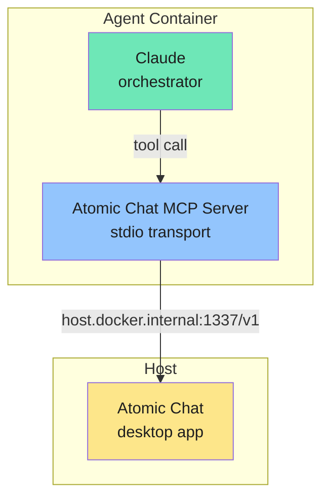

NanoClaw can delegate work to local models running in the [Atomic Chat](https://github.com/AtomicBot-ai/Atomic-Chat) desktop app while Claude stays in charge as the orchestrator. Atomic Chat exposes an OpenAI-compatible API on `http://127.0.0.1:1337/v1`; the `/add-atomic-chat-tool` skill wires an MCP server into the container that bridges to it.

## How it works

The skill adds a stdio-based MCP server inside the agent container. It registers two tools:

| Tool | Description |
|------|-------------|
| `atomic_chat_list_models` | Lists models currently available in Atomic Chat (`GET /v1/models`) |
| `atomic_chat_generate` | Sends a prompt to a specified model and returns the response (`POST /v1/chat/completions`) |

Model management (download, delete, swap) happens through the **Atomic Chat desktop UI** — Atomic Chat is a fork of Jan and manages its own model library. The MCP server is strictly a read-and-infer bridge.

The container reaches Atomic Chat on the host via `host.docker.internal:1337`, with a fallback to `localhost`. Claude decides when to route a task to a local model based on your prompt — you don't configure routing rules.



## Prerequisites

1. Download Atomic Chat from the [latest release](https://github.com/AtomicBot-ai/Atomic-Chat/releases) (macOS only at the moment).
2. Open **Settings → Local API Server** and enable it on port `1337`.
3. Open the **Hub** / **Models** tab and download at least one model (for example Llama 3.2 3B or Qwen 2.5 Coder 7B).
4. Send any message inside Atomic Chat once to warm the model up.

Verify the API is reachable from the host:

```bash
curl -s http://127.0.0.1:1337/v1/models | head
```

## Installation

Apply the skill in Claude Code:

```
/add-atomic-chat-tool
```

Or manually:

```bash
git fetch upstream skill/atomic-chat-tool
git merge upstream/skill/atomic-chat-tool
```

The skill adds:

- `container/agent-runner/src/atomic-chat-mcp-stdio.ts` — MCP server that bridges to Atomic Chat
- `atomic_chat` entry in `mcpServers` in the agent-runner's `index.ts`
- `mcp__atomic_chat__*` appended to `TOOL_ALLOWLIST` in the Claude provider
- `[ATOMIC]` log surfacing and `ATOMIC_CHAT_HOST` / `ATOMIC_CHAT_API_KEY` forwarding in the host container runner
- `ATOMIC_CHAT_HOST` / `ATOMIC_CHAT_API_KEY` stubs in `.env.example`

Rebuild the container after merging:

```bash
pnpm run build
./container/build.sh
```

## Configuration

Both variables are optional. Leave them unset for a local Atomic Chat install — it does not require authentication.

<ParamField path="ATOMIC_CHAT_HOST" type="string" default="http://host.docker.internal:1337">
  Override the host where Atomic Chat's OpenAI-compatible API is exposed. Falls back to `localhost` if `host.docker.internal` is unreachable.
</ParamField>

<ParamField path="ATOMIC_CHAT_API_KEY" type="string">
  API key for Atomic Chat. Only set this if you've put Atomic Chat behind a reverse proxy that enforces authentication.
</ParamField>

Set them in `.env` if needed:

```bash
ATOMIC_CHAT_HOST=http://host.docker.internal:1337
ATOMIC_CHAT_API_KEY=sk-...
```

The host container runner only forwards each variable into the container when it's explicitly set.

## Usage

Once installed, Claude can use Atomic Chat transparently:

> "Use atomic chat to tell me the capital of France."

Claude will call `atomic_chat_list_models` to discover what's available, then `atomic_chat_generate` with an appropriate model. You can also be explicit:

> "Use the atomic_chat_generate tool with llama3.2-3b-instruct to translate this paragraph to Spanish."

The model ID passed to `atomic_chat_generate` must exactly match one of the IDs returned by `atomic_chat_list_models`.

## Logs

Agent-runner logs prefixed with `[ATOMIC]` surface at `info` level in `logs/nanoclaw.log`:

- `[ATOMIC] Listing models...` — list request started
- `[ATOMIC] Found N models` — models discovered
- `[ATOMIC] >>> Generating with <model>` — generation started
- `[ATOMIC] <<< Done: <model> | Xs | N tokens | M chars` — generation completed

Tail them while testing:

```bash
tail -f logs/nanoclaw.log | grep -i atomic
```

## Troubleshooting

**Agent says "Atomic Chat is not installed" or tries to run a CLI.** The agent is looking for a CLI that doesn't exist instead of using the MCP tools. Check that the MCP server is registered in the agent-runner, that `mcp__atomic_chat__*` is in the Claude provider's tool allowlist, and that you rebuilt the container image after merging the skill.

**"Failed to connect to Atomic Chat."** Confirm the Local API Server is enabled in Atomic Chat's settings and that `curl http://127.0.0.1:1337/v1/models` succeeds on the host. From inside Docker, verify `host.docker.internal` is reachable: `docker run --rm curlimages/curl curl -s http://host.docker.internal:1337/v1/models`. If you set `ATOMIC_CHAT_HOST`, check the value in `.env`.

**`model not found` / 404 on generate.** The model ID must exactly match one returned by `atomic_chat_list_models`. Ask the agent to list models first, then pick one.

**Slow first response.** Atomic Chat lazy-loads models into memory on first use. The initial call is slower while the model warms up; subsequent calls are fast.

**Context or output size issues.** Atomic Chat respects each model's native context length. If you hit limits, pass `max_tokens` explicitly when calling `atomic_chat_generate`, or switch to a model with a larger context window in the Atomic Chat UI.

## Related pages

- [Ollama integration](/integrations/ollama) — Alternative tool-mode local model bridge
- [Skills system](/integrations/skills-system) — How skill branches work
- [Configuration](/api/configuration) — Full environment variable reference
- [Container runtime](/advanced/container-runtime) — How agent containers work
