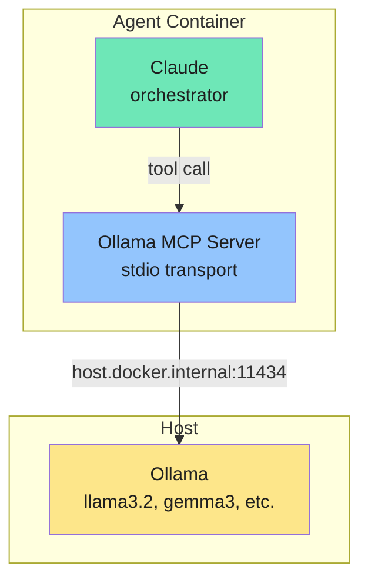

<Warning>
In v2, Ollama moved from a core integration to a skill on the `providers` branch. Install via `/add-ollama-provider` (run Ollama as a full provider for an agent group) or `/add-ollama-tool` (keep Claude as the agent, expose Ollama as a tool). The MCP setup described below reflects v1 mechanics; a v2 rewrite is pending. See [Integrations overview](/integrations/overview#providers) for the v2 provider model.
</Warning>

NanoClaw can delegate tasks to local models running on [Ollama](https://ollama.com), while Claude remains the orchestrator. This lets you offload cheaper tasks (summarization, translation, general queries) to local models and reduce API costs.

## How it works

The `/add-ollama-tool` skill adds a stdio-based MCP server inside the agent container. The MCP server exposes these tools:

| Tool | Description | Requires |
|------|-------------|----------|
| `ollama_list_models` | Lists all locally installed Ollama models | — |
| `ollama_generate` | Sends a prompt to a specified model and returns the response | — |
| `ollama_pull_model` | Pulls (downloads) a model from the Ollama registry | `OLLAMA_ADMIN_TOOLS=true` |
| `ollama_delete_model` | Deletes a locally installed model to free disk space | `OLLAMA_ADMIN_TOOLS=true` |
| `ollama_show_model` | Shows model details: parameters, template, architecture info | `OLLAMA_ADMIN_TOOLS=true` |
| `ollama_list_running` | Lists models currently loaded in memory with resource usage | `OLLAMA_ADMIN_TOOLS=true` |

The container agent reaches Ollama on the host via `host.docker.internal:11434`. Claude decides when to use local models based on task complexity — you don't need to configure routing rules.



## Prerequisites

Install Ollama and pull at least one model:

```bash
# Install Ollama (macOS/Linux)
curl -fsSL https://ollama.com/install.sh | sh

# Pull a model
ollama pull llama3.2        # Good general purpose (2GB)
ollama pull gemma3:1b       # Small and fast (1GB)
ollama pull qwen3-coder:30b # Best for code tasks (18GB)
```

Verify Ollama is running:

```bash
ollama list
```

## Installation

Apply the skill in Claude Code:

```
/add-ollama-tool
```

Or manually:

```bash
git fetch upstream skill/ollama-tool
git merge upstream/skill/ollama-tool
```

This adds:
- `container/agent-runner/src/ollama-mcp-stdio.ts` — MCP server that bridges to Ollama
- `scripts/ollama-watch.sh` — macOS notification watcher for Ollama status
- Ollama MCP configuration and `[OLLAMA]` log surfacing in the agent runner
- `OLLAMA_ADMIN_TOOLS` config option for model management tools

After merging, rebuild the container:

```bash
./container/build.sh
```

## Configuration

Set `OLLAMA_HOST` in `.env` if Ollama runs on a non-default address:

```bash
# Default (usually correct — no need to set)
OLLAMA_HOST=http://host.docker.internal:11434
```

The MCP server automatically falls back to `localhost` if `host.docker.internal` fails.

To enable admin tools (pull, delete, show, list running), add:

```bash
OLLAMA_ADMIN_TOOLS=true
```

<Note>
Ollama must be running on the host before starting NanoClaw. The MCP server writes status to `/workspace/ipc/ollama_status.json` so the host process can surface connection issues in logs.
</Note>

## Usage

Once installed, Claude can use local models transparently. For example:

> "Summarize this document using a local model"

Claude will call `ollama_list_models` to see available models, then `ollama_generate` with the appropriate prompt. You can also be explicit about which model to use:

> "Use llama3.2 to translate this to Spanish"

## Third-party model endpoints

Independently of Ollama, NanoClaw supports any Anthropic API-compatible endpoint. The cleanest way to wire one up is via setup flags:

```bash
bash nanoclaw.sh \
  --anthropic-base-url https://your-api-endpoint.com \
  --anthropic-auth-token your-token-here
```

When both are set, setup short-circuits the auth-method prompt, stores the token in the OneCLI vault as a generic Bearer secret keyed to the URL hostname, writes `ANTHROPIC_BASE_URL` to `.env`, and registers the `claude` provider container config. The container only ever sees `ANTHROPIC_BASE_URL` plus a placeholder `ANTHROPIC_AUTH_TOKEN` — OneCLI rewrites the `Authorization` header on the wire so the real token never enters the container.

This allows you to use:
- Open-source models on [Together AI](https://together.ai), [Fireworks](https://fireworks.ai), etc.
- Custom model deployments with Anthropic-compatible APIs

<Note>
Standard installs hitting `api.anthropic.com` don't load the `claude` provider config at all — setup only appends `import './claude.js'` to `src/providers/index.ts` when a custom endpoint is configured.
</Note>

<Warning>
When using custom endpoints, the OneCLI Agent Vault still intercepts container API requests. Ensure the endpoint is reachable from the host.
</Warning>

## Related pages

- [Skills system](/integrations/skills-system) — How skills work
- [Configuration](/api/configuration) — Environment variables reference
- [Container runtime](/advanced/container-runtime) — How agent containers work
