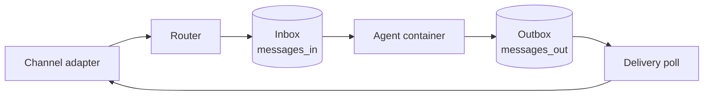

{/* verified-against: src/index.ts, src/router.ts, src/channels/index.ts, src/container-runtime.ts, src/container-runner.ts, src/db/schema.ts, src/modules/, container/agent-runner/src/mcp-tools/agents.ts, agents.instructions.md, core.ts, .claude/skills/, .claude/skills/add-telegram/SKILL.md, repo-tokens/badge.svg, package.json @ 435233a (v2.1.15) */}

NanoClaw runs Claude agents that talk to you over your messaging apps — and to each other. One Node host process handles routing and delivery. Every active session gets its own Docker container, so agents can run Bash and edit files without touching your host or each other.

A single pattern drives the whole system: every message is a row in a SQLite queue. A user chat, an inbound webhook, a scheduled job, an agent delegating to another agent — all of them land in an inbox table (`messages_in`), and every response leaves through an outbox (`messages_out`). A scheduled task is just a message with a `process_after` timestamp. There is no separate scheduler, RPC layer, or job system to learn.

<CardGroup cols={2}>
  <Card title="Run it" icon="rocket" href="/quickstart">
    Clone, install, and talk to your first agent.
  </Card>
  <Card title="Coming from v1 or OpenClaw" icon="route" href="/migrate-from-v1">
    What changed, what carries over, and the migration skills that do the work.
  </Card>
  <Card title="Make it yours" icon="wrench" href="/extend/overview">
    Add channels, tools, skills, and alternative agent providers to your fork.
  </Card>
  <Card title="How it works" icon="diagram-project" href="/concepts/architecture">
    The entity model, session databases, and the inbox/outbox pattern in depth.
  </Card>
</CardGroup>

## How a message flows

Every channel — Telegram, Discord, a webhook, the built-in CLI — feeds the same pipeline:

The router resolves who sent the message, which agent group should handle it, and which session it belongs to, then writes the row and wakes the container. The container processes its inbox and writes replies to its outbox; the host's delivery polls pick them up and hand them back to the channel adapter. Agent-to-agent messages follow the exact same path — an agent's `send_message` is a row addressed to another agent's inbox.

## Why it's built this way

**Container isolation.** Agents run in Docker containers and see only what you explicitly mount. Bash and file edits execute inside the container, never on your host. Each session gets its own container, so parallel conversations can't interfere with each other.

**Small enough to hold in context.** The codebase is ~194k tokens — small enough for Claude Code to hold in context. That's also how you customize it: edit the code, not a config sprawl.

**Channels are skills, not bundled features.** Main ships exactly one channel — the local CLI. Everything else lives on the `channels` branch and gets copied into your fork by a skill: `/add-telegram`, `/add-discord`, `/add-whatsapp`, `/add-slack`, `/add-signal`, `/add-imessage`, and several more. Your install contains the adapters you asked for and nothing else. The same mechanism covers alternative agent providers (`/add-codex`, `/add-opencode`, `/add-ollama-provider`).

## Agents that work together

An agent can spawn long-lived companion agents with `create_agent` — each with its own container, workspace, and persistent memory — and delegate to them over the same message queue. That's enough to build real teams: a worker per task, a manager that tracks what's in flight, a supervisor that pings you for approval. See the [multi-agent swarm guide](/guides/multi-agent-swarm).

## Who this is for

- **Operators** — you want a personal AI assistant on your own machine, reachable from your messaging apps. Start with the [quickstart](/quickstart).
- **Builders** — you want to extend it: new channels, tools, skills, or agent providers in your own fork. Start with [extending NanoClaw](/extend/overview).
- **Evaluators and contributors** — you want to judge the design before trusting it. Start with the [architecture](/concepts/architecture) and the [security model](/concepts/security).

## Source and community

- **Source**: [github.com/nanocoai/nanoclaw](https://github.com/nanocoai/nanoclaw) (MIT)
- **Discord**: [community server](https://discord.gg/VDdww8qS42)
